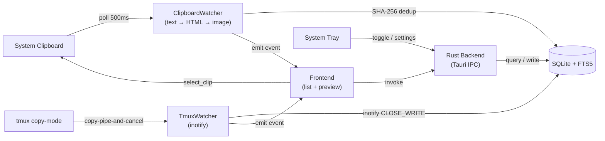

<p align="center">
  
</p>

<p align="center">
  <strong>A lightweight, blazing-fast clipboard manager for Linux</strong>
</p>

<p align="center">
  <a href="https://github.com/51hhh/Clippy/actions/workflows/build.yml">
    
  </a>
  <a href="https://github.com/51hhh/Clippy/releases/latest">
    
  </a>
  <a href="https://github.com/51hhh/Clippy/blob/main/LICENSE">
    
  </a>
  <a href="https://github.com/51hhh/Clippy/releases">
    
  </a>
</p>

<p align="center">
  <a href="README.md">English</a> | <a href="docs/README.zh-CN.md">中文</a>
</p>

---

Clippy lives in your system tray, watches the clipboard in the background, and lets you search and recall anything you've copied — text, HTML, images — with a single hotkey.

Built with **Tauri v2 + Rust**. No Electron. No bloat.

## Screenshots

<table>
  <tr>
    <td align="center"><br><sub>Clipboard list</sub></td>
    <td align="center"><br><sub>Code preview with syntax highlighting</sub></td>
  </tr>
  <tr>
    <td align="center"><br><sub>Settings &amp; themes</sub></td>
    <td align="center"><br><sub>Image preview + settings</sub></td>
  </tr>
</table>

## Features

- **Multi-type clipboard** — Captures text, HTML, and images with SHA-256 deduplication
- **tmux integration** — Captures tmux copy-mode via `copy-pipe-and-cancel`, inotify-driven instant detection, auto-binding verification
- **Rich text preview** — Press `Tab` to open the preview panel:
  - Code highlighting — auto-detects 21 languages via highlight.js
  - Markdown rendering — scoring-based detection with GFM support
  - HTML safe render — DOMPurify-sanitized rich text preview
  - Image preview — inline PNG with resolution info
- **Instant search** — SQLite FTS5 full-text search, millisecond results
- **Floating panel** — Borderless popup, global hotkey toggle, auto-hide on blur
- **Keyboard-driven** — Full keyboard navigation with vim-style keys (WASD)
- **Global shortcuts** — X11 (`tauri-plugin-global-shortcut`) + Wayland (XDG Portal / gsettings)
- **Automatic paste** — X11 restores the previous target window; Wayland reuses a persistent RemoteDesktop Portal session and falls back to copy-only when unavailable
- **Screenshot workflow** — One frozen overlay does everything: click empty space for the whole screen, click a window to grab it, or drag a free area; the full toolbar sits next to the selection and the selection stays re-framable; the check mark copies the cropped and annotated image straight to the clipboard
- **Annotation** — 16 tools in three groups (select/draw/effects) with image adjustments, undo/redo and a single-canvas export, shared by the overlay and Pin windows
- **Translation** — LibreTranslate-compatible and OpenAI-compatible providers with Secret Service keys, timeout/retry and sensitive-content protection
- **6 themes** — Light, Dark, Nord, Solarized, Rose, Midnight
- **Favorites** — Pin clips to a dedicated tab, immune to history cleanup
- **Auto update** — Built-in updater via GitHub Releases
- **i18n** — English and Simplified Chinese

## Install

Grab the latest `.deb` or `.AppImage` from [Releases](https://github.com/51hhh/Clippy/releases/latest).

```bash
# Debian / Ubuntu
sudo dpkg -i clippy_*.deb

# AppImage
chmod +x Clippy_*.AppImage && ./Clippy_*.AppImage
```

**OCR (optional):** Image text recognition requires Tesseract 5. The in-app Install button is Linux-only; other platforms show their manual installation command:

```bash
# Debian / Ubuntu
sudo apt install tesseract-ocr tesseract-ocr-chi-sim

# macOS (Homebrew; MacPorts is also supported)
brew install tesseract
```

On Windows, install a current Tesseract 5 build, then restart Clippy. Clippy checks `CLIPPY_TESSERACT_PATH`, a future bundled sidecar, the process `PATH`, and conventional Linux/macOS/Windows install locations in that order. Without Tesseract, Clippy works normally and only OCR is unavailable.

## Build from Source

Requires: Rust toolchain, Node.js ≥ 20.19, Tauri v2 system dependencies.

```bash
sudo apt install -y \
  libwebkit2gtk-4.1-dev build-essential curl wget file \
  libxdo-dev libssl-dev libayatana-appindicator3-dev librsvg2-dev pkg-config xdg-utils

cargo install tauri-cli --version "^2"

git clone https://github.com/51hhh/Clippy.git && cd Clippy
cd src && npm install && cd ..
cargo tauri build
```

Output: `src-tauri/target/release/bundle/`

> **Tip**: If the pre-built deb doesn't work on your distro (e.g. system library mismatch), building from source ensures full compatibility with your system.

## Tech Stack

| Layer | Technology |
|-------|-----------|
| Framework | [Tauri v2](https://v2.tauri.app/) |
| Backend | Rust — arboard, rusqlite, sha2, image, ashpd |
| Frontend | Vanilla HTML / CSS / JS (ES Modules) |
| Preview | highlight.js · marked · DOMPurify |
| Database | SQLite + FTS5 |
| Build | Vite (multi-page) |

## Architecture

See [docs/architecture.md](docs/architecture.md) for current ownership, capture/Pin/translation flows, and platform boundaries.

Reference-project findings and integration boundaries are summarized in [docs/reference-project-guidance.md](docs/reference-project-guidance.md).



## Project Structure

```
src/                          # Frontend
├── index.html                # Main panel (list + preview)
├── settings.html             # Settings window
├── js/
│   ├── api.ts                # Typed Tauri IPC wrapper (sole boundary)
│   ├── ipc-types.ts          # Rust serde payload contracts
│   ├── app.js                # Entry + keyboard routing
│   ├── clipboard-list.js     # List state machine + diff render
│   ├── preview-panel.js      # Preview state/detection dispatcher
│   ├── preview/              # Code, metadata, format, content and crypto renderers
│   ├── search-bar.js         # Search UI
│   └── settings.js           # Settings logic
├── styles/                   # CSS
└── i18n/                     # en, zh-CN

src-tauri/src/                # Rust backend
├── lib.rs                    # App init + plugin setup
├── commands.rs               # AppState + compatibility re-exports
├── commands/                 # Clipboard, settings, tmux, capture, OCR, URL commands
├── clipboard_watcher.rs      # Clipboard polling thread
├── storage.rs                # SQLite/FTS5 core and search
├── storage/                  # Maintenance, stats, URL cache and storage tests
├── config.rs                 # JSON config
├── models.rs                 # Data models
├── gsettings_shortcuts.rs    # Wayland shortcut support
├── tray_icon.rs              # Themed tray icon
├── paste/                    # X11, Wayland Portal and copy-only coordinator
├── capture/                  # CaptureSession and monitor overlays
├── pin/                      # Unified PinManager and window lifecycle
└── translation/              # Providers, errors, request IDs and keyring secrets
```

## Development

```bash
cargo tauri dev                              # Dev server (hot-reload)
cd src-tauri && cargo check --all-targets     # Compile check
cd src-tauri && cargo test                   # Unit tests
cd src-tauri && cargo clippy --all-targets -- -D warnings  # Lint
cd src && npx vitest run                     # Frontend tests
./scripts/ci-local.sh                        # Full local gate + DOM/Xvfb smoke
```

## Contributing

Contributions welcome. Please open an issue first to discuss changes.

1. Fork → branch (`git checkout -b feat/my-feature`)
2. Commit (`git commit -m 'feat: add feature'`)
3. Push → Pull Request

## Credits

- [Tauri](https://tauri.app/) — Smaller, faster, more secure desktop apps
- [arboard](https://github.com/1Password/arboard) — Cross-platform clipboard
- [rusqlite](https://github.com/rusqlite/rusqlite) — SQLite for Rust
- [ashpd](https://github.com/bilelmoussaoui/ashpd) — XDG Portal bindings
- [highlight.js](https://highlightjs.org/) — Syntax highlighting
- [marked](https://marked.js.org/) — Markdown parser
- [DOMPurify](https://github.com/cure53/DOMPurify) — HTML sanitizer

## License

[MIT](LICENSE)
