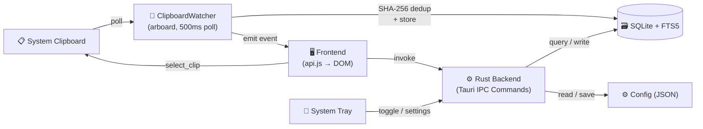

<p align="center">
  
</p>

<p align="center">
  <strong>A lightweight, blazing-fast clipboard manager for Linux</strong>
</p>

<p align="center">
  <a href="https://github.com/51hhh/Clippy/actions/workflows/build.yml">
    
  </a>
  <a href="https://github.com/51hhh/Clippy/releases/latest">
    
  </a>
  <a href="https://github.com/51hhh/Clippy/blob/main/LICENSE">
    
  </a>
  <a href="https://github.com/51hhh/Clippy/releases">
    
  </a>
</p>

<p align="center">
  <a href="README.md">English</a> | <a href="docs/README.zh-CN.md">中文</a>
</p>

---

## What is Clippy?

Clippy is a clipboard manager built with **Tauri v2 + Rust**, designed to be minimal, fast, and stay out of your way. It lives in your system tray, watches your clipboard in the background, and lets you search and recall any copied text with a single keyboard shortcut.

## Features

- **Clipboard Monitoring** — Automatically captures everything you copy (text), with SHA-256 deduplication
- **Instant Search** — Full-text search powered by SQLite FTS5, find anything in milliseconds
- **Floating Panel** — Borderless popup (380×500) toggled by a global hotkey, auto-hides on focus loss
- **Global Shortcuts** — Works on both X11 (via `tauri-plugin-global-shortcut`) and Wayland (via XDG Portal / gsettings)
- **System Tray** — Themed SVG tray icon that adapts to light/dark desktop themes
- **Settings Panel** — Shortcut recorder, theme switcher (6 built-in themes), history limit configuration
- **Favorites** — Pin important clips so they're never cleaned up
- **Auto Update** — Built-in updater checks GitHub Releases for new versions
- **i18n** — English and Simplified Chinese out of the box

## Quick Start

### Download

Grab the latest `.deb` or `.AppImage` from [GitHub Releases](https://github.com/51hhh/Clippy/releases/latest).

```bash
# Debian / Ubuntu
sudo dpkg -i clippy_*.deb

# AppImage — just make it executable
chmod +x Clippy_*.AppImage
./Clippy_*.AppImage
```

### Build from Source

**Prerequisites**: Rust toolchain, Node.js ≥ 20, system libs for Tauri v2 on Linux.

```bash
# Install system dependencies (Ubuntu / Debian)
sudo apt install -y \
  libwebkit2gtk-4.1-dev build-essential curl wget file \
  libxdo-dev libssl-dev libayatana-appindicator3-dev librsvg2-dev pkg-config

# Install Tauri CLI
cargo install tauri-cli --version "^2"

# Clone and build
git clone https://github.com/51hhh/Clippy.git
cd Clippy
cd src && npm install && cd ..
cargo tauri build
```

Build artifacts appear in `src-tauri/target/release/bundle/`.

## Tech Stack

| Layer | Technology |
|-------|-----------|
| Framework | [Tauri v2](https://v2.tauri.app/) |
| Backend | Rust (arboard, rusqlite, sha2, ashpd) |
| Frontend | Vanilla HTML / CSS / JS (ES Modules) |
| Database | SQLite with FTS5 full-text search |
| Build | Vite (multi-page: main + settings) |

## Architecture



## Project Structure

```
src/                    # Frontend
├── index.html          # Main floating panel
├── settings.html       # Settings window
├── js/                 # ES Modules (api, app, search, settings, theme…)
├── styles/             # CSS (base, components, themes, settings)
└── i18n/               # Translations (en, zh-CN)

src-tauri/src/          # Rust backend
├── lib.rs              # Tauri init: plugins, tray, shortcuts, state
├── commands.rs         # IPC commands
├── clipboard_watcher.rs# Clipboard polling thread (arboard, 500ms)
├── storage.rs          # SQLite + FTS5 engine
├── config.rs           # JSON config read/write
├── models.rs           # Data models
├── gsettings_shortcuts.rs # Wayland shortcut support
└── tray_icon.rs        # Themed SVG tray icon
```

## Development

```bash
# Start dev server (hot-reload frontend + Rust backend)
cargo tauri dev

# Rust checks
cd src-tauri && cargo check       # Compile check
cd src-tauri && cargo test        # Unit tests
cd src-tauri && cargo clippy -- -D warnings  # Lint
cd src-tauri && cargo fmt         # Format

# Frontend tests
cd src && npx vitest run
```

## Contributing

Contributions are welcome! Please open an issue first to discuss what you'd like to change.

1. Fork the repository
2. Create your feature branch (`git checkout -b feat/amazing-feature`)
3. Commit your changes (`git commit -m 'feat: add amazing feature'`)
4. Push to the branch (`git push origin feat/amazing-feature`)
5. Open a Pull Request

## Credits

Built with these amazing open-source projects:

- [Tauri](https://tauri.app/) — Build smaller, faster, more secure desktop apps
- [arboard](https://github.com/1Password/arboard) — Cross-platform clipboard library
- [rusqlite](https://github.com/rusqlite/rusqlite) — SQLite bindings for Rust
- [ashpd](https://github.com/bilelmoussaoui/ashpd) — XDG Desktop Portal bindings

## License

[MIT](LICENSE)
