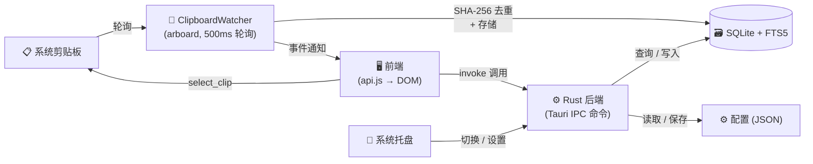

<p align="center">
  
</p>

<p align="center">
  <strong>轻量、极速的 Linux 剪贴板管理器</strong>
</p>

<p align="center">
  <a href="https://github.com/51hhh/Clippy/actions/workflows/build.yml">
    
  </a>
  <a href="https://github.com/51hhh/Clippy/releases/latest">
    
  </a>
  <a href="https://github.com/51hhh/Clippy/blob/main/LICENSE">
    
  </a>
  <a href="https://github.com/51hhh/Clippy/releases">
    
  </a>
</p>

<p align="center">
  <a href="../README.md">English</a> | <a href="README.zh-CN.md">中文</a>
</p>

---

## Clippy 是什么？

Clippy 是一款基于 **Tauri v2 + Rust** 构建的剪贴板管理器，追求极致轻量与高效。它安静地驻留在系统托盘中，后台监听剪贴板变化，让你通过一个快捷键即可搜索和回溯任何复制过的文本。

## 功能特性

- **剪贴板监听** — 自动捕获所有复制的文本内容，SHA-256 哈希去重
- **即时搜索** — 基于 SQLite FTS5 全文搜索引擎，毫秒级查找
- **悬浮面板** — 无边框弹出窗口 (380×500)，全局快捷键唤起，失焦自动隐藏
- **全局快捷键** — 同时支持 X11（`tauri-plugin-global-shortcut`）和 Wayland（XDG Portal / gsettings）
- **系统托盘** — 主题自适应 SVG 图标，自动匹配亮色/暗色桌面
- **设置面板** — 快捷键录制器、主题切换（内置 6 款主题）、历史记录上限配置
- **收藏夹** — 置顶重要条目，不受历史清理影响
- **自动更新** — 内置更新检查器，自动从 GitHub Releases 获取新版本
- **国际化** — 开箱即用的中英文支持

## 快速开始

### 下载安装

前往 [GitHub Releases](https://github.com/51hhh/Clippy/releases/latest) 下载最新的 `.deb` 或 `.AppImage` 包。

```bash
# Debian / Ubuntu
sudo dpkg -i clippy_*.deb

# AppImage — 赋予执行权限后直接运行
chmod +x Clippy_*.AppImage
./Clippy_*.AppImage
```

### 从源码构建

**前置要求**：Rust 工具链、Node.js ≥ 20、Tauri v2 Linux 系统依赖。

```bash
# 安装系统依赖（Ubuntu / Debian）
sudo apt install -y \
  libwebkit2gtk-4.1-dev build-essential curl wget file \
  libxdo-dev libssl-dev libayatana-appindicator3-dev librsvg2-dev pkg-config

# 安装 Tauri CLI
cargo install tauri-cli --version "^2"

# 克隆并构建
git clone https://github.com/51hhh/Clippy.git
cd Clippy
cd src && npm install && cd ..
cargo tauri build
```

构建产物位于 `src-tauri/target/release/bundle/` 目录。

## 技术栈

| 层 | 技术 |
|----|-----|
| 框架 | [Tauri v2](https://v2.tauri.app/) |
| 后端 | Rust (arboard, rusqlite, sha2, ashpd) |
| 前端 | 原生 HTML / CSS / JS (ES Modules) |
| 数据库 | SQLite + FTS5 全文搜索 |
| 构建 | Vite（多页面：主面板 + 设置） |

## 架构



## 项目结构

```
src/                    # 前端
├── index.html          # 主悬浮面板
├── settings.html       # 设置窗口
├── js/                 # ES Modules (api, app, search, settings, theme…)
├── styles/             # CSS (base, components, themes, settings)
└── i18n/               # 翻译文件 (en, zh-CN)

src-tauri/src/          # Rust 后端
├── lib.rs              # Tauri 初始化：插件、托盘、快捷键、状态管理
├── commands.rs         # IPC 命令
├── clipboard_watcher.rs# 剪贴板轮询线程 (arboard, 500ms)
├── storage.rs          # SQLite + FTS5 存储引擎
├── config.rs           # JSON 配置读写
├── models.rs           # 数据模型
├── gsettings_shortcuts.rs # Wayland 快捷键支持
└── tray_icon.rs        # 主题自适应托盘图标
```

## 开发指南

```bash
# 启动开发服务器（前端热重载 + Rust 后端）
cargo tauri dev

# Rust 检查
cd src-tauri && cargo check       # 编译检查
cd src-tauri && cargo test        # 单元测试
cd src-tauri && cargo clippy -- -D warnings  # Lint 检查
cd src-tauri && cargo fmt         # 代码格式化

# 前端测试
cd src && npx vitest run
```

## 贡献

欢迎贡献！请先开 Issue 讨论你想做的改动。

1. Fork 本仓库
2. 创建特性分支 (`git checkout -b feat/amazing-feature`)
3. 提交更改 (`git commit -m 'feat: add amazing feature'`)
4. 推送分支 (`git push origin feat/amazing-feature`)
5. 发起 Pull Request

## 致谢

感谢以下优秀的开源项目：

- [Tauri](https://tauri.app/) — 构建更小、更快、更安全的桌面应用
- [arboard](https://github.com/1Password/arboard) — 跨平台剪贴板库
- [rusqlite](https://github.com/rusqlite/rusqlite) — Rust 的 SQLite 绑定
- [ashpd](https://github.com/bilelmoussaoui/ashpd) — XDG Desktop Portal 绑定

## 许可证

[MIT](../LICENSE)
