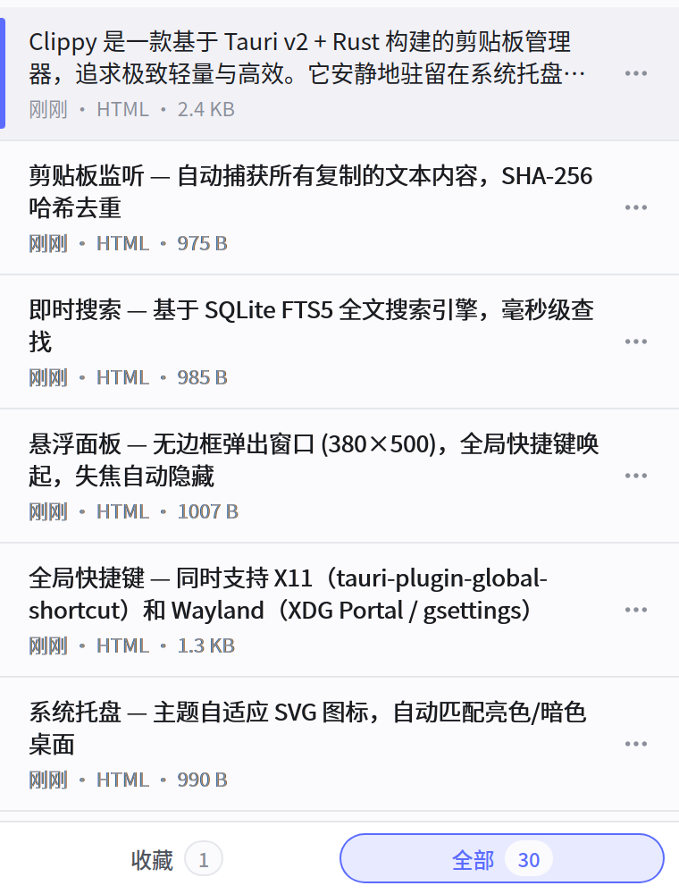
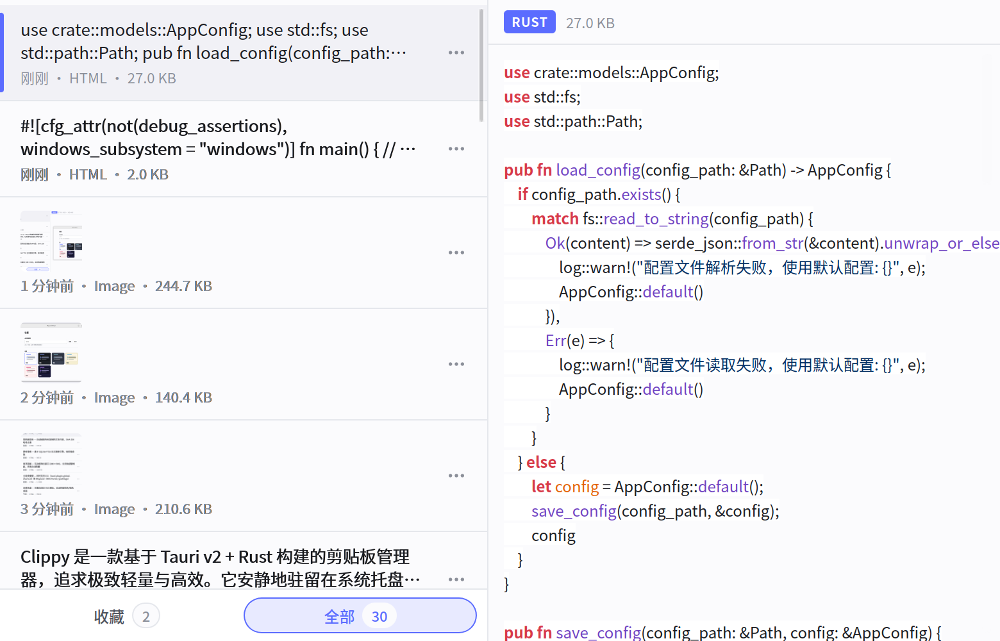
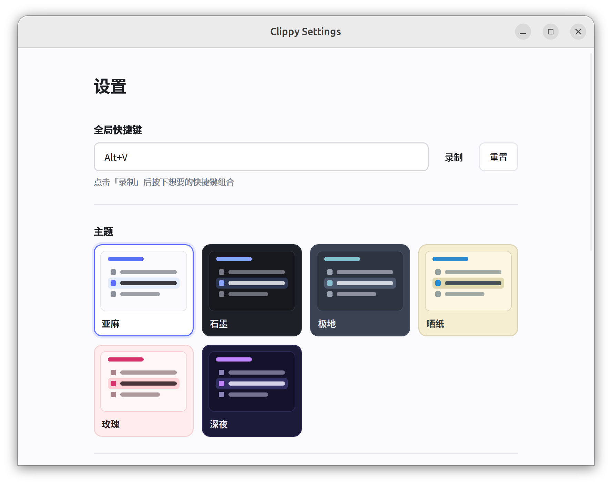
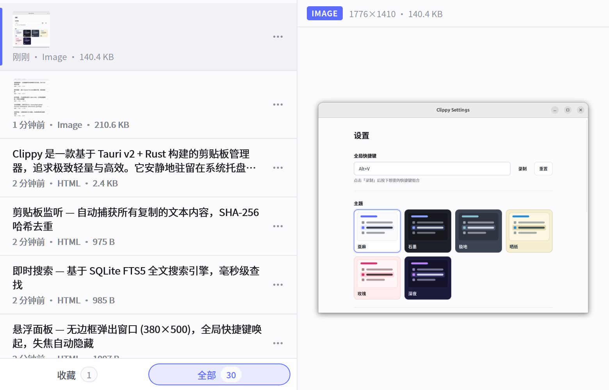
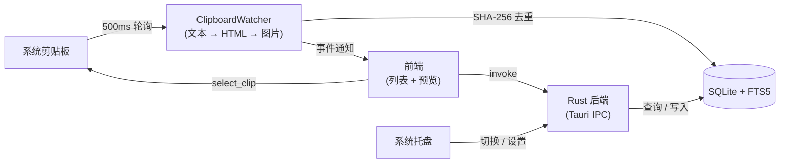

<p align="center">
  
</p>

<p align="center">
  <strong>轻量、极速的 Linux 剪贴板管理器</strong>
</p>

<p align="center">
  <a href="https://github.com/51hhh/Clippy/actions/workflows/build.yml">
    
  </a>
  <a href="https://github.com/51hhh/Clippy/releases/latest">
    
  </a>
  <a href="https://github.com/51hhh/Clippy/blob/main/LICENSE">
    
  </a>
  <a href="https://github.com/51hhh/Clippy/releases">
    
  </a>
</p>

<p align="center">
  <a href="../README.md">English</a> | <a href="README.zh-CN.md">中文</a>
</p>

---

Clippy 安静地驻留在系统托盘，后台监听剪贴板变化，让你通过一个快捷键即可搜索和回溯所有复制过的内容——文本、HTML、图片。

基于 **Tauri v2 + Rust** 构建，没有 Electron，没有臃肿。

## 截图展示

<table>
  <tr>
    <td align="center"><br><sub>剪贴板列表</sub></td>
    <td align="center"><br><sub>代码预览 + 语法高亮</sub></td>
  </tr>
  <tr>
    <td align="center"><br><sub>设置面板 + 主题切换</sub></td>
    <td align="center"><br><sub>图片预览 + 设置窗口</sub></td>
  </tr>
</table>

## 功能特性

- **多类型剪贴板** — 自动捕获文本、HTML 和图片，SHA-256 哈希去重
- **富文本预览** — 按 `Tab` 键展开预览面板：
  - 代码高亮 — 自动检测 21 种编程语言，highlight.js 渲染
  - Markdown 渲染 — 多特征评分检测，支持 GFM 语法
  - HTML 安全渲染 — DOMPurify 过滤后的富文本预览
  - 图片预览 — 内联 PNG 预览，显示分辨率信息
- **即时搜索** — SQLite FTS5 全文搜索，毫秒级响应
- **悬浮面板** — 无边框弹出窗口，全局快捷键唤起，失焦自动隐藏
- **键盘驱动** — 完整键盘导航，支持 Vim 风格按键 (WASD)
- **全局快捷键** — 同时支持 X11（`tauri-plugin-global-shortcut`）和 Wayland（XDG Portal / gsettings）
- **6 款主题** — 亚麻、石墨、极地、晒纸、玫瑰、深夜
- **收藏夹** — 置顶重要条目，不受历史清理影响
- **自动更新** — 内置更新器，从 GitHub Releases 获取新版本
- **国际化** — 中文 / 英文

## 安装

前往 [Releases](https://github.com/51hhh/Clippy/releases/latest) 下载最新的 `.deb` 或 `.AppImage`。

```bash
# Debian / Ubuntu
sudo dpkg -i clippy_*.deb

# AppImage
chmod +x Clippy_*.AppImage && ./Clippy_*.AppImage
```

## 从源码构建

前置要求：Rust 工具链、Node.js ≥ 20、Tauri v2 系统依赖。

```bash
sudo apt install -y \
  libwebkit2gtk-4.1-dev build-essential curl wget file \
  libxdo-dev libssl-dev libayatana-appindicator3-dev librsvg2-dev pkg-config

cargo install tauri-cli --version "^2"

git clone https://github.com/51hhh/Clippy.git && cd Clippy
cd src && npm install && cd ..
cargo tauri build
```

构建产物：`src-tauri/target/release/bundle/`

## 技术栈

| 层 | 技术 |
|----|-----|
| 框架 | [Tauri v2](https://v2.tauri.app/) |
| 后端 | Rust — arboard, rusqlite, sha2, image, ashpd |
| 前端 | 原生 HTML / CSS / JS (ES Modules) |
| 预览 | highlight.js · marked · DOMPurify |
| 数据库 | SQLite + FTS5 |
| 构建 | Vite（多页面） |

## 架构



## 项目结构

```
src/                          # 前端
├── index.html                # 主面板（列表 + 预览）
├── settings.html             # 设置窗口
├── js/
│   ├── api.js                # Tauri IPC 封装
│   ├── app.js                # 入口 + 键盘路由
│   ├── clipboard-list.js     # 列表状态机 + 差量渲染
│   ├── preview-panel.js      # 富文本预览引擎
│   ├── search-bar.js         # 搜索 UI
│   └── settings.js           # 设置逻辑
├── styles/                   # CSS
└── i18n/                     # 中文、英文

src-tauri/src/                # Rust 后端
├── lib.rs                    # 应用初始化 + 插件注册
├── commands.rs               # IPC 命令处理
├── clipboard_watcher.rs      # 剪贴板轮询线程
├── storage.rs                # SQLite + FTS5 存储
├── config.rs                 # JSON 配置
├── models.rs                 # 数据模型
├── gsettings_shortcuts.rs    # Wayland 快捷键
└── tray_icon.rs              # 主题自适应托盘图标
```

## 开发

```bash
cargo tauri dev                              # 开发服务器（热重载）
cd src-tauri && cargo check                  # 编译检查
cd src-tauri && cargo test                   # 单元测试
cd src-tauri && cargo clippy -- -D warnings  # Lint
cd src && npx vitest run                     # 前端测试
```

## 贡献

欢迎贡献！请先开 Issue 讨论你想做的改动。

1. Fork → 创建分支 (`git checkout -b feat/my-feature`)
2. 提交更改 (`git commit -m 'feat: add feature'`)
3. 推送 → Pull Request

## 致谢

- [Tauri](https://tauri.app/) — 更小、更快、更安全的桌面应用框架
- [arboard](https://github.com/1Password/arboard) — 跨平台剪贴板库
- [rusqlite](https://github.com/rusqlite/rusqlite) — Rust 的 SQLite 绑定
- [ashpd](https://github.com/bilelmoussaoui/ashpd) — XDG Portal 绑定
- [highlight.js](https://highlightjs.org/) — 语法高亮
- [marked](https://marked.js.org/) — Markdown 解析器
- [DOMPurify](https://github.com/cure53/DOMPurify) — HTML 净化器

## 许可证

[MIT](../LICENSE)
