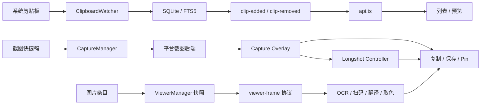

# Clippy 完整结构与平台边界审阅

审阅日期：2026-09-17

代码基线：`dev` / `84e1c1a9fdd93e2c7dfea43b877478dde641804b`
（移除提交 trailer 前的等价提交为 `80889e32381dcaf28949c7b7b6cbdab4b61d6483`）

对应整改计划：[`2026-09-17-architecture-hardening-plan.md`](../superpowers/plans/2026-09-17-architecture-hardening-plan.md)

## 审阅目标

确认当前应用的模块职责、核心调用链、窗口权限和条件编译是否清晰，并判断现有约束能否阻止：

- 平台分支只在某一个宿主编译，带着问题合入 `dev`；
- 截图、粘贴、快捷键对同一个 Linux 会话给出不同结论；
- 子窗口调用不属于自己的业务命令；
- Rust serde、Tauri command 与前端 IPC 类型长期漂移；
- 大型状态机继续增长后失去可审阅性；
- 架构文档、编码规则和生产代码互相矛盾。

## 当前结论

项目核心架构已经比较成熟。截图、长截图、Pin、查看器、OCR 和剪贴板监听均有明确的资源所有权，
对晚到异步结果、ABA、窗口销毁、并发输出和载荷预算的测试明显强于普通桌面应用。

现有约束仍有四个缺口：

1. Linux 本地门禁不能证明 Windows/macOS 条件编译代码正确；
2. `platform` 声称是平台事实源，但截图和粘贴仍重复读取环境变量；
3. 查看器已经有业务 IPC 白名单，其他子窗口没有同级约束；
4. Rust 核心约束强，vanilla JS、IPC 合同和文档同步主要依赖人工审查。

因此当前状态适合继续开发，但发布必须以同一 SHA 的三平台 CI 成功为前提。

## 验证基线

### 本地门禁

在允许回环 HTTP、Xvfb 和浏览器进程的本机环境执行 `./scripts/ci-local.sh`：

- 14 个步骤通过，0 失败；
- Rust：793 通过、12 忽略；
- X11 私有显示协议回归：4/4 通过；
- 前端：59 个文件、1123 项测试通过；
- `cargo fmt`、`cargo check --all-targets`、Clippy、TypeScript、DOM/Canvas/布局 smoke、
  Vite 构建和 built-main 检查通过；
- 非宿主交叉检查和 AppImage 可视 smoke 未启用，不计为通过。

### 远程门禁

- 上一基线 `e59d631` 的 CI 运行 `35178040491`：Ubuntu 成功，Windows 测试失败，
  macOS Clippy 失败；
- `e9387f5`（重写前 `4fba021`）已包含 Windows `.desktop` 测试隔离、vendored arboard macOS/Wayland API
  迁移和本地门禁覆盖范围说明；其 CI `35179825379` 中 Ubuntu、Windows 成功，macOS 的
  `ocr::enhanced::tests::cancelled_after_enhanced_non_timeout_failure_does_not_start_fallback` 失败；
- `84e1c1a`（重写前 `80889e3`）进一步将该测试从固定 `/usr/bin/python3` 改为 PATH 解析出的真实解释器，并把冷启动
  等待从 2 秒改为 15 秒；其 CI `35180661672` 已完成，Ubuntu、Windows、macOS 三个 job 均为
  success：<https://github.com/51hhh/Clippy/actions/runs/35180661672>。

`80889e3` 是历史重写前第一个三平台同 SHA 全绿的基线；其等价 tree 位于 `84e1c1a`。
`scripts/verify-native-ci.mjs` 对重写前 SHA 输出
`Result: PASS`（证据文件按仓库惯例只留在本地工作区，不随仓库分发）。

同一 SHA 的 `Native QA Packages` run `35181379112` 也已全部成功，产出 Linux x64、Windows x64、
macOS Intel、macOS Apple-Silicon 四套 QA 安装包与记录模板，并通过 Ubuntu 24.04 X11 Runtime Smoke。

三平台 CI 成功只证明平台条件编译、原生 API 与单元测试成立。桌面权限、焦点恢复、输入注入、
混合 DPI 和签名信任链都不在其覆盖范围内，真机矩阵尚未执行，因此这不构成发布结论。

## 核心调用链

这三条链在代码中可追踪，但缺少一个与代码同步的短入口图；现有 `architecture.md` 更像深入参考手册。

## 模块评价

| 模块 | 清晰度 | 现有约束 | 主要缺口 |
|---|---|---|---|
| 启动与 `AppState` | 中上 | Tauri `manage()` 集中资源所有权 | 状态字段接近 20 个，跨域 transition mutex 逐渐形成 service locator |
| 剪贴板与存储 | 高 | 哈希去重、写入唤醒、代际校验、SQLite 事务测试 | `storage.rs` 仍偏大，文档对写入链描述比代码落后 |
| 主前端与预览 | 中上 | 唯一 `api.ts` 边界、DOMPurify、丰富 Vitest | 大部分 vanilla JS 没有静态检查，`innerHTML` 规则与实现矛盾 |
| 普通截图 | 高 | `CaptureManager`、几何 fixture、多显示器诊断、资源预算 | manager 和 backend 文件较大；Wayland 判断重复实现 |
| 长截图 | 领域模型高、组织中 | generation/token、ABA、取消补偿和窗口销毁矩阵测试完整 | 生产注释仍称“未接入”；模块级 lint 豁免；`window_host.rs` 过大 |
| Pin / 图片编辑 | 中上 | canonical pixels、后端权威合成、可编辑/扁平输出分离 | command 层同时承担校验、保存、输出和窗口协调 |
| 图片查看器 | 高 | 快照身份、私有协议、工具结果隔离、业务 IPC allowlist | allowlist 没有推广到其他子窗口 |
| OCR / 翻译 | 中上 | 并发上限、single-flight、进程回收、超时、敏感内容边界 | `ocr.rs` 偏大；错误合同仍混用 typed error 与字符串 |
| 平台层 | 中上 | target-scoped dependencies、typed capability model | 截图/粘贴绕过事实源；vendor patch 无条件作用于三平台 |
| CI 与文档 | 中上 | Linux + Windows + macOS 原生 runner，完整本地 smoke | 分支保护待确认；本地计划、代码和架构说明存在漂移 |

## 发现与证据

### P0：三平台门禁已闭环，但 vendor patch 的跨平台归属是长期风险

`src-tauri/Cargo.toml` 的 `[patch.crates-io]` 无条件替换 `arboard`。补丁动机是 Linux X11
完成屏障和有界 INCR 传输，但替换后的 macOS、Windows、Wayland 源码也由本项目负责维护。

三个原生失败已在重写前 `80889e3`（等价 tree：`84e1c1a`）上由真实 runner 证明修复：

- Linux `.desktop` 自启动解析与测试只在 `target_os = "linux"` 编译；
- vendored arboard 的 macOS CoreGraphics 和 `image::ImageReader` 弃用 API 已迁移；
- OCR 取消测试改用 PATH 解析出的解释器。macOS 的 `/usr/bin/python3` 只是 Command Line Tools
  的 shim，`is_file()` 能通过所以配置校验不报错，失败点落在子进程启动标记上。这个失败此前一直
  被 macOS Clippy 失败挡在后面，直到编译恢复才第一次暴露。

门禁闭环不等于风险消失。Linux `--all-targets` 不编译其他操作系统分支，所以 vendor 目录里
macOS / Windows / Wayland 源码的每次改动仍然只能由远程 runner 判定；`wayland.rs` 更位于非默认
feature `wayland-data-control` 之后，连 Linux 门禁都编译不到它。

### P1：长截图生产状态与注释/lint 合同矛盾

`capture/mod.rs` 对 `longshot` 和 `mode_gate` 使用生产构建的模块级 `allow(dead_code)`，注释称
IPC/UI 未接入；同一模块已经注册完整的打开、激活、ready、append、preview、finish、cancel 命令。

风险：

- 真正失去调用方的代码不会被 Clippy 发现；
- 新维护者会误判长截图仍是试验代码；
- `AppState` 注释仍把已上线能力称为“未来长截图”。

应移除宽范围豁免，让编译器列出真实未使用项，再逐个删除、接线或保留窄范围说明。

### P1：Linux 会话识别存在三个事实源

标准事实源是 `platform::current_session()`。以下模块仍直接读取 `XDG_SESSION_TYPE`、
`WAYLAND_DISPLAY` 和 `DISPLAY`：

- `paste/mod.rs::detect_backend`；
- `screenshot/backends.rs::is_wayland_session`。

当前优先级基本一致，但未来对 XWayland、嵌套 compositor 或环境变量缺失的修复可能只落到一处，
使截图、自动粘贴和快捷键能力出现冲突。

启动前选择 GDK backend 与诊断报告采集原始环境值属于合理例外，应在代码与测试中显式列出。

### P1：自定义 IPC 只对查看器执行最小权限

`viewer::access::restrict` 会拒绝 `image-viewer-*` 调用白名单外业务命令；其他窗口标签进入相同
全局 `generate_handler!` 时没有等价限制。Tauri core/plugin capability 只约束已声明权限，不能自动
替代自定义业务命令矩阵。

当前 CSP、静态资源和关键 command 内部的 caller/handle 校验降低了风险，但窗口边界应成为统一规则，
不能要求每个未来 command 作者记得自行判断调用者。

### P2：IPC 名称和 serde 合同依赖人工同步

生产源码中只有 `src/js/api.ts` 直接导入 Tauri API，本次扫描未发现前端 literal invoke 漏注册。
复杂查看器/OCR 返回值也有运行时预算校验。

缺少的自动约束：

- Rust `#[tauri::command]` 与 `generate_handler!` 的完整性；
- 前端 wrapper 使用的命令是否存在；
- `ipc-types.ts` 是否与 Rust serde 命名、optional/null 和整数范围一致；
- 动态 `viewerInvoke(command)` 使用的命令是否仍在查看器 allowlist。

### P2：前端静态约束只覆盖 React/TS 功能岛

`tsconfig.json` 只包含 `react`、测试、`api.ts`、`ipc-types.ts` 和 Vite 配置。主窗口、列表、预览、
设置等 vanilla JS 由测试保护，但没有 no-undef、no-unused-vars、Promise 处理、模块依赖和 Tauri import
边界检查。

`AGENTS.md` 绝对禁止 `innerHTML`，而生产设计实际允许 DOMPurify 清洗后的 Markdown、富文本和代码
高亮 sink。正确约束应是“用户富文本只允许经过固定 DOMPurify 配置进入审计过的 sink”。

### P2：核心热点文件已接近审阅上限

| 文件 | 当前规模 | 说明 |
|---|---:|---|
| `capture/longshot/window_host.rs` | 6018 行；生产约 2413 行 | registry、window lifecycle、append、preview、finish/cancel 混合 |
| `capture/manager.rs` | 2152 行 | 普通截图会话、资源协调和测试集中 |
| `pin/commands.rs` | 1787 行 | IPC、校验、保存、合成输出混合 |
| `screenshot/backends.rs` | 1423 行 | 六级 Linux fallback 与非 Linux xcap 同文件 |
| `js/api.ts` | 1011 行 | 单一边界正确，但按领域拆 facade 的时机已到 |
| `ocr.rs` | 991 行 | 进程、探测、并发、Tesseract fallback 集中 |

拆分必须保持状态转移测试先行，不做一次性目录搬迁。

### P3：架构与流程文档漂移

- `CLAUDE.md` 仍引用不存在的 `react/capture/`，没有列出 viewer、longshot-controller、shared；
- `CLAUDE.md` 只展示少量 `AppState` 字段，已不足以解释现有资源所有权；
- `architecture.md` 对局部实现很深，但缺少完整功能岛列表和短调用链入口；
- `feature-lifecycle.md` 允许需求说明只留在本地，无法与提交形成稳定追溯；
- `AGENTS.md` 的 XSS 规则与 DOMPurify 生产路径矛盾。

## 平台分支判断

| 平台 | 代码路径 | 结论 | 未验证边界 |
|---|---|---|---|
| Linux X11 | xcap/XRandR、X11 自动粘贴、私有 Xvfb INCR 测试 | 分支清晰，本地证据强 | AppImage 真机可视 smoke 未启用 |
| GNOME Wayland | Mutter PipeWire → GNOME 扩展 → wlroots → Portal →旧 GNOME API → xcap | fallback 顺序和失败语义清楚 | 会话判断没有统一走 platform |
| 其他 Wayland | wlroots / Portal、RemoteDesktop Portal 粘贴 | 能力降级明确 | compositor 真实矩阵仍依赖人工 QA |
| Windows | xcap、SendInput、Windows ACL/API | cfg 与依赖切分合理；重写前 `80889e3` native check 成功 | 桌面权限、输入注入、混合 DPI 仍只能靠真机 QA |
| macOS | Screen Recording/Accessibility 权限、xcap、Quartz/AppKit | 重写前 `80889e3` 编译、Clippy 与全部单元测试成功 | 权限授权流程、Gatekeeper/公证信任链未验证 |
| 其他系统 | CopyOnly / Unsupported | 不伪装成完整支持 | 不在正式构建目标内 |

## 已有的强约束

- 自定义截图、Pin、查看器图片协议都绑定调用窗口与当前快照；
- 查看器所有异步工具带 session/snapshot/request identity；
- 长截图对代际、ABA、窗口销毁和输出不确定性有系统测试；
- OCR 已具备探测缓存、并发限制、single-flight、取消和子进程回收；
- 图片、PNG、OCR 文本、代码扫描和输出均有尺寸/数量预算；
- 平台依赖大部分放在 target-specific Cargo section；
- Linux、Windows、macOS 使用真实原生 runner，而不是只做交叉编译；
- `dev` / `main` 由 ruleset `23578066` 保护：三个原生 job 为 required checks，禁止强推、禁止删除，
  且不设 bypass actor（例外必须显式改动 ruleset，属于可审计动作）；
- 富文本生产 sink 使用 DOMPurify，普通用户文本使用文本节点或 `textContent`。

## 仍需建立的约束

1. 产品平台决策只允许从 `platform` 获取；
2. 所有非主窗口使用显式业务命令 allowlist；
3. command 注册、前端 wrapper、错误码和 serde 合同进入 CI；
4. vanilla JS 进入静态检查，并固定允许的 HTML sink；
5. 架构文档保存短调用链、所有权和验证边界，深度实现说明下沉到领域文档。

原「`dev/main` 必须由三平台 required checks 保护」已落地，移入上一节。副作用是直连推送会被
required checks 挡住（新提交上还没有通过的检查），后续 `dev` 改动须走 PR；这与
`docs/feature-lifecycle.md` §2.4 记载的本地 `--no-ff` 合并直推流程冲突，需在 Phase 8 一并更新。

## 未完成的依赖风险核查

`npm ci` 报告 2 个 moderate vulnerability。当前没有判断它们位于生产依赖还是开发工具链。
`npm audit --json` 会把依赖树与版本元数据发送到 npm 服务；因尚未获得该外发的明确授权，
本次没有执行。后续如执行，应先取得项目所有者的授权，再记录 advisory、可达性、
修复版本和升级风险。
