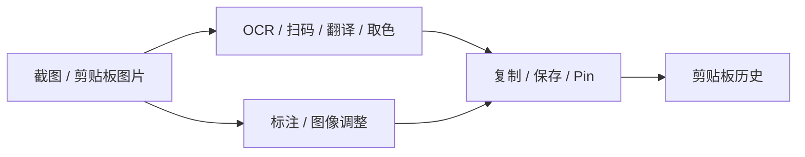

# PixPin 功能差距与 Clippy 后续路线

审阅日期：2026-09-18

代码基线：`dev` / `2383cc0cad00e4a07799d31e1b471e7c1ce6e568`

需求与路线标识：`PX-ROADMAP-2026-09`

## 目标

把 PixPin 解析得到的 168 项能力映射到 Clippy 当前代码，区分代码已经存在、安装后默认可用、
真实平台已经验收三种状态，并给后续功能建立可追踪的优先级、依赖关系和验收边界。

本报告只评价可观察行为、公开接口和 Clippy 自有实现。研究样本中的私有算法、模型和会员能力
不构成 Clippy 的产品需求，也不构成重新分发许可。

## 状态口径

| 状态 | 含义 |
|---|---|
| ✅ 已交付 | 有正常产品入口、生产实现和自动化保护；仍可能保留真机矩阵边界 |
| 🟡 能力存在 | 主链或开发运行时已经实现，但默认安装、格式覆盖、持久化或真实平台验收仍不完整 |
| ❌ 未实现 | 没有对应的产品领域、正常入口或生产数据链 |

“168 项”是参考能力的分类计数，不是 Clippy 的测试通过数。领域内只要存在关键交付缺口，
整栏就不能以一个勾号表示全部完成。

## 校正后的总表

| PixPin 域 | 项数 | 代码状态 | 默认交付 | 结论 |
|---|---:|---|---|---|
| 截图与选区 | 16 | ✅ | ✅ | 冻结帧、多屏、窗口探测、选区、`mode_gate` 和输出主链已接入；混合 DPI 与权限仍需真机矩阵 |
| 本地 OCR 与版面 | 20 | ✅ | 🟡 | PP-OCRv6 det/rec、EdgeGNN、逐框识别、CTC、结构化结果与 XY-cut 已实现；增强运行时和 Edge 模型未随安装包分发 |
| QR 与条码 | 8 | 🟡 | 🟡 | 多结果、反色和 `TryHarder` 已实现；生产格式白名单只有 QR Code 与 Code 39，不能称为通用条码覆盖 |
| 配置与本地操作 | 13 | ✅ | ✅ | 设置、版本迁移、自启动、快捷键、保存目标和更新器均有产品入口 |
| 长截图 | 15 | 🟡 | 🟡 | 固定选区、竖向向下、手动追加主链完整；无自动滚动、反向裁剪、横向与前接 |
| 标注与图像效果 | 23 | 🟡 | 🟡 | 16 种工具及模糊、马赛克、聚光灯、放大镜、调色和圆角已接入；无语义智能擦除 |
| 贴图 / 历史 / 分组 | 29 | 🟡 | 🟡 | Pin、缩放、透明度、锁定、置顶、编辑和工程 PNG 已实现；Pin 会话只在内存中，无工作区、分组或恢复库 |
| 本地导出与交换 | 12 | 🟡 | 🟡 | 单图复制、保存、另存、扁平 PNG 与 iTXt 工程 PNG 已实现；无批量归档导入导出 |
| 录屏 / 音频 / 编码 | 20 | ❌ | ❌ | 没有录制领域、音频采集、编码、封装、恢复清单或产品入口 |
| 动作 / 脚本 / 启动器 | 12 | ❌ | ❌ | 没有用户动作注册表、权限模型、脚本运行时或动作启动器 |

原表的整体方向成立。需要修正的重点有两处：增强 OCR 是“实现完成、交付未完成”；扫码是
“QR Code 与 Code 39 主链完成、格式覆盖有限”。

## 当前已经实现的功能链

### 截图、选区与长截图

普通截图由 `capture::CaptureManager` 持有冻结帧和覆盖层会话，平台后端完成多显示器采集，
`mode_gate` 保证普通截图与长截图不会同时占用捕获资源。选区可以复制、保存、Pin，或交给长截图
控制窗口。

长截图不是连续录屏。`capture/longshot/session.rs` 接收已裁好的相邻 RGBA 帧，
`estimate_vertical_overlap` 估计竖向重叠，再由 `VerticalStitcher` 追加新增部分。
当前控制器明确提供 `Append / Copy / Save / Pin / Cancel`，所以它的准确描述是：

- 固定选区；
- 用户自行向下滚动；
- 每次点击手动重采并追加；
- 低纹理、低相似、歧义、无新增、过大位移和资源超限时保持原会话可重试；
- 最多 64 帧，并受像素和内存预算约束。

代码中没有滚轮或平台输入注入驱动自动滚动，也没有反向裁剪、横向拼接或前接状态。

### 本地 OCR 与版面

`src-tauri/ocr-sidecar/` 已实现以下开发运行时：

```text
PNG
  → PP-OCRv6 small det
  → 原图文字框与大图 tile 合并
  → clippy-edge-features-v1
  → EdgeGNN 段落分组
  → Clippy XY-cut 阅读顺序
  → 原像素透视 crop
  → PP-OCRv6 small rec
  → greedy CTC
  → lines / paragraphs / pipeline / fallbackReason
```

Rust 侧 `ocr/enhanced.rs` 校验绝对路径、模型 SHA、运行脚本身份、输入输出预算和 deadline，
并复用全局并发许可、single-flight、取消与子进程回收。结构化结果还会校验坐标、行 ID、段落引用、
阅读顺序、引擎和 feature schema。增强失败可以在剩余统一期限内回退 Tesseract；预算和超时失败不会
再启动第二引擎。

交付缺口在运行时配置：增强 OCR 依赖 `CLIPPY_OCR_MANIFEST`、隔离 Python、公开 det/rec/字典，
以及用户已有且有权使用的 Edge 模型。仓库不打包权重，三平台安装器也没有安装和健康检查流程。
未配置时产品使用 Tesseract。因此 `docs/pixpin-analysis.md` 原先“当前仍只有 Tesseract、应先做
结构化后端”的判断已经失效；本地研究副本已同步到当前边界。

### QR 与条码

`code_detection.rs` 具备以下保护和行为：

- 灰度输入、缩放、坐标映射与有界输出；
- `TryHarder` 和 `AlsoInverted`；
- 一张图最多返回 32 个去重结果；
- 全局并发限制和相同请求合并；
- 查看器工具栏入口与快照身份校验。

生产 `possible_formats()` 只返回 `QR_CODE` 与 `CODE_39`，测试还明确断言 Micro QR 不被暴露。
后续格式应由真实使用场景和 fixture 驱动，不能把 rxing 依赖支持的所有枚举自动算成产品能力。

### 标注、查看器与 Pin

共享标注核心定义了 16 种工具：裁剪、对象、橡皮、画笔、马克笔、矩形、椭圆、高亮、直线、
箭头、测量、文字、模糊、马赛克、聚光灯和放大镜。这里的“橡皮”删除编辑对象，
不执行内容感知修复或生成式补全，所以不能计作智能擦除。

图片查看器承担图片深度操作，使用无限画布、缩放和平移，并把 OCR、扫码、翻译、取色和绘制放在
同一工具栏。剪贴板侧边栏只负责快速预览和进入查看器；Pin 负责持续悬浮参考。两者职责不同，
图片预览仍有必要，但复杂工具继续集中在查看器。

`PinManager` 使用进程内 `HashMap<String, PinEntry>` 持有打开的窗口；窗口销毁就移除条目。
数据库只有 clips、FTS、URL 元数据和翻译历史，没有 Pin 工作区或分组表。可编辑 PNG 通过 iTXt
保存原图、标注和调整参数，能够拖入主窗口继续编辑；这是一种文件级恢复，不等于 Pin 历史库。

### 导出、录制与动作

当前图片输出覆盖剪贴板、单文件 PNG、另存为、扁平导出和可编辑工程 PNG。没有集合清单、批量导出、
导入冲突策略或恢复整个 Pin 工作区的协议。

仓库内的 PipeWire screencast 依赖服务于 Wayland 截图授权和帧获取。它没有录制时间线、麦克风、
系统音频、编码器或 MP4/WebM/GIF 封装，不能计作录屏基础设施。现有 shortcut recorder 只是快捷键录入，
也不是屏幕录制。

“action”一词目前只表示局部 UI 行为和输出选择。仓库没有可发现的动作注册表、参数 schema、权限声明、
脚本宿主或启动器。

## 产品方向

Clippy 当前最完整的闭环是：



后续投入应先把这条闭环变成三平台默认可靠能力，再扩展 Pin 工作区与批量交换。长截图的方向增强
建立在现有会话和像素预算上。录屏会新增持续采集、音频、编码、恢复和隐私权限五个领域，适合独立
里程碑。动作系统先建立类型化动作与权限，再评估脚本运行时。

## 2026-09-18 质量与数据模型决策

本节把后续实现收敛到五条可独立验收的链路。它同时修正两个容易造成错误实现的概念：

1. `EdgeGNN` 的 Edge 是文字框图中的“边”，不是图像边缘增强。`edge_features.py` 把检测框作为
   节点，把相邻框的距离、重叠、对齐、高度比和颜色差作为边特征；模型输出用于段落分组，Clippy
   再用 XY-cut 决定阅读顺序。它不锐化笔画，也不直接提高单字置信度。
2. PP-OCR 的检测结果是文字区域/行四边形，逐框透视裁切的作用是减少背景、倾斜和尺度干扰；
   它不等于逐字符检测。中英日混排、连续空格、数字、符号和二维公式仍由识别模型的训练覆盖、
   字典、CTC 解码和专用公式模型共同决定。

### OCR 调研结论

当前增强链在结构上比单次整图 Tesseract 更适合复杂截图：它先检测文字区域，再从原始像素做透视
裁切，并保留框、行、段落和阅读顺序。不过仓库还没有同一真实语料上对 Tesseract 与增强链的 A/B
结果，因此不能把“结构更完整”写成“识别率已经更高”。现有 PixPin 合成样本只能证明链路工作，
不能证明中英日、空格、公式和低质量截图普遍优于现有回退引擎。

Clippy 当前使用 PP-OCRv6 small det/rec、18,708 项公开字典和额外 ASCII 空格类。字典包含常见中日
字符、拉丁字母、数字和大量数学符号，说明这些码点可以被解码；字典覆盖不代表模型一定能正确识别。
当前 greedy CTC 会合并相邻重复类别，只有 blank 才能分隔重复字符，所以窄空格、连续相同字符和
低置信间隔必须进入专项语料。公式也不能只靠字符序列恢复分数、上下标、根式和矩阵的二维结构；
PaddleOCR 官方把公式识别作为 PP-FormulaNet/UniMERNet 独立模块，Clippy 应采用显式公式路由，不能
把普通 OCR 文本伪装成 LaTeX。

官方资料还给出三个与实现直接相关的边界：

- PP-OCRv6 small recognition 是单模型 50 语言路线，但官方指标来自其内部数据集，不能直接外推到
  Clippy 的剪贴板截图；medium 模型精度更高但包体与运行资源也更大；
- 官方另有英语专用模型并明确强调空格遗漏改善，说明通用多语言模型的空格保真必须单独测量；
- 官方 OCR pipeline 可选文档方向、去畸变和文字行方向模块，当前 Clippy sidecar 只有竖长 crop 的
  90° 旋转启发式，没有这些完整方向/展开阶段。

资料：

- [PP-OCRv6 技术说明](https://github.com/PaddlePaddle/PaddleOCR/blob/main/docs/version3.x/algorithm/PP-OCRv6/PP-OCRv6.en.md)
- [PaddleOCR 文字识别模块](https://github.com/PaddlePaddle/PaddleOCR/blob/main/docs/version3.x/module_usage/text_recognition.en.md)
- [PaddleOCR OCR pipeline](https://github.com/PaddlePaddle/PaddleOCR/blob/main/docs/version3.x/pipeline_usage/OCR.en.md)
- [PaddleOCR 公式识别模块](https://www.paddleocr.ai/main/en/version3.x/module_usage/formula_recognition.html)

### OCR 优化顺序

OCR 先建立可重复评测，再改变模型或后处理。评测保留原始 Unicode 和空白，至少分别报告：检测框
precision/recall/Hmean、原始码点 CER、去空白 CER、空白 precision/recall/F1、整行完全匹配率、
阅读顺序错误、公式结构准确率、端到端耗时和峰值内存。不得只用去空白或统一标点后的结果掩盖复制
文本的真实差异。

语料按以下维度分层并保留来源/许可：中英混排、中日混排、三语混排、连续与全角空格、重复字符、
整数/小数/百分比/货币/日期/序列号、成对与全半角标点、常用数学符号、代码、表格、多栏、旋转、
低对比/缩放/压缩、竖排和独立公式区域。每个样本保存原图、文字框、逐行文本、段落与阅读顺序；
公式样本另存结构化真值。

优化阶段按评测证据推进：

1. 固定当前 Tesseract 与 PP-OCRv6 small 基线，不改阈值；
2. 分开定位检测漏框、裁切/方向、字符识别、CTC 空白和版面排序问题；
3. 先调检测/裁切和方向，再 A/B small 与 medium 或语言专用模型；
4. 对连续空格和重复字符评估 beam/word-boundary 后处理，但原始结果始终可追溯；
5. 公式检测后走独立公式识别器，普通文字仍走 PP-OCR；
6. 只有固定语料中目标分层改善、其他关键分层不回退且资源预算满足时才替换默认链。

### 截图快捷工具与二维长截图

普通截图工具条已经有长截图按钮。本阶段保留该入口，并增加 QR/条码按钮；扫码直接读取当前
`capture session + selection revision` 对应的冻结原图选区，不先写入 clips，也不读取带标注的合成图。
返回结果必须绑定请求代次，用户改变选区后晚到结果不得显示。结果浮层支持多码、格式、复制和打开
链接，识别失败不关闭截图。

进入长截图后，原截图覆盖层结束，现有控制器让底下窗口可以由用户滚动。后续若需要持续显示选区
边界，应新建只绘制边界且输入透明的 guide window，不能让冻结覆盖层继续拦截滚轮；控制器仍负责
开始、暂停、撤销、完成和错误恢复。第一阶段是手动滚动和采样，不做系统级输入注入。

二维拼接不把“反向滚动”解释为静默裁掉已完成内容。会话保存不可变帧及其有符号全局位置：

- 向下/右出现新区域时扩展底部/右侧；
- 向上/左越过已有边界时前接顶部/左侧；
- 回到已覆盖区域时只更新当前 viewport anchor，不修改已提交像素；
- “撤销”显式移除最近一次帧提交，“裁剪”由用户在完成前明确执行；
- 位移估计必须区分水平/垂直主轴并有滞回，歧义、动态内容和固定页头失败保持原结果可导出。

最终画布以所有已提交帧的 union bounds 物化，像素预算、帧数、混合 DPI 和显示器身份仍受现有
`mode_gate` 与会话所有权保护。自动滚动在二维手动主链稳定后再做，并按平台探测输入权限、焦点、
停止键和页面到底条件。

### 标注与图像效果质量

现有 16 个工具先建立同一源图上的前端预览/Rust 权威导出对照，覆盖 1x/1.25x/2x DPR、透明边缘、
极细/极粗笔画、裁剪边界和多次编辑。重点检查模糊邻域裁切、马赛克格边界、箭头与测量端点、文字
字体差异、放大镜插值、圆角 alpha、聚光遮罩以及旋转/缩放后的坐标稳定性。改动必须从不可变原图
按源像素坐标重绘，不能从上一次屏幕预览继续采样；黄金图、PSNR/像素差和人工视觉样本共同验收。

“橡皮”继续表示删除标注对象。内容感知擦除是独立能力，必须先满足许可、包体、延迟和失败可撤销
条件，不能用模糊或背景色覆盖冒充。

### 内部可编辑图片修订链

用户期望的是应用内部管理的无损修订，不是每次保存一个重复携带原图的自包含 PNG。该模型合理，
但“指针”必须是数据库内稳定的内容地址 ID，不能是临时文件路径，也不能只指向会被历史清理的
`clips.id`。

目标数据模型：

```text
image_assets
  asset_id = SHA-256(canonical source bytes/pixels), immutable PNG/blob, dimensions

image_projects
  project_id, root_asset_id, current_revision_id, lifecycle

image_revisions
  revision_id, project_id, parent_revision_id,
  canonical_document(源像素坐标的累计标注/调整), rendered_asset_id, renderer_version

clips
  rendered_asset_id, optional image_revision_id
```

保存流程严格是“从根图渲染”，不是“从上次渲染图继续画”：原图 1 只存一次；保存修订 2 时写入
`root 1 + document 2`，生成无损 PNG 2；再次编辑修订 2 时加载根图 1 和 document 2，保存为
`root 1 + document 3`，生成 PNG 3。`document 3` 可以是规范化累计文档并带 `parent_revision_id`；
这样读取不需要重放无限 delta，同时仍能追踪历史。显式 resize/crop 之外不重采样，PNG 输出和源像素
坐标保证代际间没有画质损失。

剪贴板只复制渲染 PNG，不携带未打码原图和编辑操作。Clippy 自己重新收到完全相同的 PNG 时，可按
渲染内容哈希恢复其 `image_revision_id`；经过第三方转码、缩放或像素修改后按普通图片处理。跨设备或
文件级继续编辑改为显式“导出工程归档”，现有自包含 iTXt PNG 只作为兼容导入/显式导出格式，
不再是默认内部保存格式。

清理采用外键加可达性，而不是手工引用计数猜测：只要 project、revision、clip 或保存的 Pin 工作区
仍可达根 asset，根图就禁止删除；后台清理只能移除没有任何引用的临时渲染和中断修订。删除一个
剪贴板条目不能破坏仍被后续修订引用的根图。迁移现有 iTXt 工程时解出根图、规范化 document 和
当前渲染图，校验哈希后一次性导入新结构；损坏工程仍退回扁平 PNG。

## 实施顺序

| 阶段 | 路线 ID | 内容 | 依赖 |
|---|---|---|---|
| P0 | `PX-OCR-QUALITY-01` | 混合文字/空白/符号/公式质量语料、指标与双引擎基线 | 当前 OCR 输出合同 |
| P0 | `PX-OCR-01` | 基于基线完成增强 OCR 安装、健康检查、许可与模型选择 | `PX-OCR-QUALITY-01` |
| P0 | `PX-CAPTURE-TOOLS-01` | 冻结选区快捷扫码；保留现有长截图入口 | capture session 身份 |
| P1 | `PX-LS-2D-01` | 输入透明 guide、上下左右拼接、viewport 回访与显式撤销 | 真实长截图 fixture |
| P1 | `PX-ANNOTATION-QUALITY-01` | 16 工具预览/导出画质矩阵与逐项修正 | 权威 Rust 渲染器 |
| P1 | `PX-IMAGE-REVISION-01` | 内容寻址根图、修订 DAG、渲染 clip 关联与安全清理 | 数据库迁移设计 |
| P1 | `PX-PIN-01` | 基于 image project 的 Pin 工作区、历史恢复和分组 | `PX-IMAGE-REVISION-01` |
| P1 | `PX-IO-01` | 工程归档与批量导出/导入 | image project/clipboard 数据版本 |
| P2 | `PX-LS-AUTO-01` | 在二维手动主链稳定后增加受控自动滚动 | `PX-LS-2D-01` + 平台输入能力 |
| P2 | `PX-CODE-01` | 扫码场景矩阵，再按需求增加格式 | 可重复 fixture |
| P2 | `PX-REC-01` | 可恢复录屏最小闭环 | 平台采集/音频技术验证 |
| P3 | `PX-ACT-01` | 类型化动作注册表与启动器 | 稳定业务命令合同 |
| P3 | `PX-SMART-01` | 智能擦除可行性与质量基线 | 模型许可、包体和性能预算 |

## 路线需求与验收边界

### `PX-OCR-QUALITY-01`：OCR 质量基线与分层优化

**Goal**：用同一批有框、有文本、有顺序的样本判断检测、识别、版面和公式链是否真实改善。

**Requirements**：

- 建立版本化语料 schema，保留原始 Unicode、空格、框坐标、行/段落顺序、语言/场景标签和许可；
- 同一输入记录 Tesseract 与增强链输出，不以单一总分覆盖分层退化；
- 指标至少包含检测 Hmean、原始/去空白 CER、空白 F1、整行匹配、阅读顺序、耗时与内存；
- 普通文字与结构化公式分开评测，公式引擎缺失时明确记为 unsupported。

**Acceptance Criteria**：

- [ ] 评测器对 Unicode、连续空格、重复字符、符号、框匹配和阅读顺序有确定性单元测试；
- [ ] 首批自有/可再分发语料覆盖中英日混排、数值、符号、空格和公式路由；
- [ ] 当前 Tesseract 与 PP-OCRv6 small 在同一机器形成可复现基线报告；
- [ ] 任一模型/阈值替换均报告目标分层改善、关键分层回退和资源变化。

**Out of Scope**：用单张 PixPin 样本宣称总体精度、静默改写用户文本、把普通 OCR 当公式识别。

### `PX-CAPTURE-TOOLS-01`：冻结选区快捷长截图与扫码

**Goal**：让用户在截图选区完成后直接进入长截图或识别 QR/条码，无需先保存到历史或打开查看器。

**Requirements**：扫码读取权威冻结帧的当前选区；请求绑定 session 和 selection revision；结果浮层支持
多码、格式、复制/打开；长截图继续使用现有入口和会话所有权。

**Acceptance Criteria**：

- [ ] 扫码命令不能读取其他 capture session，也不能绕过覆盖层 IPC 白名单；
- [ ] 改变选区或关闭截图后，晚到扫码结果被丢弃；
- [ ] QR、Code 39、多码、反色、无结果和超限 fixture 均不关闭覆盖层；
- [ ] 长截图按钮继续从同一选区启动，扫码失败不影响复制/保存/Pin。

**Out of Scope**：第一阶段不新增未经 fixture 验证的条码格式，不扫描标注后的图像。

### `PX-LS-2D-01`：二维手动长截图

**Goal**：允许用户直接滚动原窗口，并把上下左右出现的新区域无损拼入同一画布。

**Requirements**：使用输入透明 guide 标记区域；会话记录不可变帧、有符号位置、viewport anchor 和可撤销
提交；回访已覆盖区域不删像素；上下左右扩展统一受像素/内存预算约束。

**Acceptance Criteria**：

- [ ] 下→上回访→继续下、右→左越界、上方前接和二维转向 fixture 得到确定像素结果；
- [ ] 回访、歧义、低纹理、动态固定区域和错误方向不会静默裁掉已提交内容；
- [ ] 撤销只移除最后一次提交，失败后原结果仍可复制/保存/Pin；
- [ ] X11、Wayland、Windows、macOS 分别验证滚轮透传、guide 位置和混合 DPI。

**Out of Scope**：系统输入注入、浏览器 DOM 控制、无限画布内存和隐式反向裁剪。

### `PX-ANNOTATION-QUALITY-01`：标注与效果画质

**Goal**：让编辑预览与权威导出在各缩放比例下保持可预测，并消除重复编辑造成的画质损失。

**Requirements**：建立 16 工具、效果、DPR、alpha 和边界黄金样本；每次导出从不可变根图按源坐标渲染；
记录前端预览与 Rust 输出允许差异（例如字体栅格化）。

**Acceptance Criteria**：

- [ ] 每个工具至少有正常、边界和高 DPI fixture；
- [ ] 模糊、马赛克、放大镜、圆角和聚光灯覆盖透明边缘与相邻像素；
- [ ] 连续保存/重开不会积累缩放、压缩或坐标误差；
- [ ] 差异超出已登记容差时测试失败并输出可审阅图片。

**Out of Scope**：智能擦除与生成式补全。

### `PX-IMAGE-REVISION-01`：内部无损图片修订链

**Goal**：根图只保存一次，每个可编辑版本引用根图与规范化编辑文档，同时提供可粘贴的扁平 PNG。

**Requirements**：新增不可变 asset、project、revision 和 clip 关联；每次从根图渲染；剪贴板只输出渲染图；
清理基于外键可达性；兼容导入现有 iTXt 工程；显式归档才携带根图和编辑信息。

**Acceptance Criteria**：

- [ ] “原图 1→修订 2→修订 3”数据库中只有一份根图，两个 revision 都能独立重开；
- [ ] PNG 2 的精确回流能恢复 revision 2，第三方转码后安全退回普通图片；
- [ ] 删除任一 clip、运行历史清理或应用重启都不会删除仍可达的根图；
- [ ] PNG 3 由根图 1 与累计 document 3 渲染，像素测试证明没有从 PNG 2 二次采样；
- [ ] iTXt v2/v3 可迁移，损坏/未来版本只导入扁平 IDAT；事务失败不留下孤儿 asset/revision。

**Out of Scope**：默认把未打码原图放进系统剪贴板、依赖文件路径、云同步和无限修订保留。

### `PX-BASE-01`：现有能力真实平台验收

**Goal**：证明已经实现的高级能力在支持平台的真实桌面上可重复完成。

**Requirements**：

- 使用同一构建 SHA 验证截图、手动长截图、查看器、OCR、扫码、Pin 工程重开；
- 覆盖 Linux X11、至少一个 Wayland compositor、Windows、macOS；
- 记录权限拒绝、混合 DPI、多显示器、动态页面和大图预算结果。

**Acceptance Criteria**：

- [ ] 每个平台按 `docs/native-qa.md` 保存构建 SHA、安装包和逐场景结果；
- [ ] 长截图保存结果能以像素或稳定视觉 fixture 复核接缝；
- [ ] 未执行和失败项保持未完成，不由单元测试替代。

**Out of Scope**：自动滚动、横向长截图、新条码格式和新模型。

### `PX-OCR-01`：增强 OCR 产品化

**Goal**：让用户能判断增强 OCR 是否可用，并通过受控流程安装或配置它。

**Requirements**：

- 设置页展示当前引擎、模型身份、健康状态、回退原因和缺失项；
- 固定公开模型来源、SHA、许可证和更新策略；
- Edge 模型的取得和分发必须先完成许可决策；
- 安装、升级和删除均不得破坏 Tesseract 回退。

**Acceptance Criteria**：

- [ ] 全新安装在没有增强运行时时明确显示 Tesseract 状态；
- [ ] 有效 manifest 能通过 UI 健康检查并完成结构化多行 OCR；
- [ ] 坏模型、错误 SHA、缺 Python、超时和取消均给出稳定错误且无残留进程；
- [ ] 三平台安装策略和包体变化有记录，未支持的平台不显示为已安装。

**Out of Scope**：复制参考产品的私有权重、训练模型、在线 OCR 和无依据的文字纠错。

### `PX-PIN-01`：Pin 工作区、历史与分组

**Goal**：恢复用户主动保存的贴图布局，并让多张参考图可以按任务组织。

**Requirements**：

- 持久化内容引用、位置、缩放、透明度、锁定、置顶、组 ID 和显示器身份；
- 区分临时 Pin、保存到工作区和内部 image project；
- 根图与修订引用复用 `PX-IMAGE-REVISION-01`，窗口标签不作为持久主键；
- 显示器缺失或 DPI 改变时执行可预测的位置恢复。

**Acceptance Criteria**：

- [ ] 应用重启后只恢复用户保存的工作区；
- [ ] 关闭临时 Pin 不会生成历史记录；
- [ ] 显示器拔插后窗口全部回到可见区域；
- [ ] 数据迁移、删除组和损坏记录具有自动化测试。

**Out of Scope**：云同步、多人共享和无限历史。

### `PX-IO-01`：批量导出与导入

**Goal**：以可校验、可迁移的归档交换剪贴板条目、image project 或 Pin 工作区。

**Requirements**：

- 归档包含版本化 manifest、内容哈希、类型、元数据和有界文件；
- 导入先完整校验，再以事务方式写入；
- 明确定义重复、收藏、敏感内容、根图/修订关系和未知未来字段策略；
- 只有显式工程归档携带根图与编辑文档，普通 PNG 导出保持扁平。

**Acceptance Criteria**：

- [ ] 导出后在空数据库导入能恢复选定内容与关系；
- [ ] 截断、超限、路径穿越、哈希错误和重复项不产生半导入；
- [ ] 旧版本 fixture 能迁移，未来版本会安全拒绝。

**Out of Scope**：在线同步和任意第三方归档格式。

### `PX-LS-AUTO-01`：自动滚动

**Goal**：在用户明确启动后，以可停止、可恢复的节奏驱动目标窗口并自动追加。

**Requirements**：

- 平台能力先探测，输入注入、焦点、滚动节奏和停止键有明确状态；
- 每次滚动仍经过现有重叠质量门禁；
- 目标失焦、页面到底、动态内容、权限拒绝和用户移动鼠标时安全停止。

**Acceptance Criteria**：

- [ ] 支持平台能从启动到停止导出完整结果；
- [ ] 任一质量门禁失败会暂停并允许手动处理；
- [ ] 不支持的平台不展示虚假的可用入口。

**Out of Scope**：后台控制浏览器 DOM、绕过系统权限、第一阶段二维手动拼接和录制视频。

### `PX-CODE-01`：扫码场景与格式扩展

**Goal**：用真实场景确定格式范围，并提高现有 QR/Code 39 的可靠性。

**Requirements**：覆盖小码、低对比、旋转、多码、反色、坐标还原、坏图和超限；新增格式必须有
产品场景、稳定格式名、fixture 和 UI 展示。

**Acceptance Criteria**：

- [ ] QR 与 Code 39 场景矩阵有端到端 fixture；
- [ ] 多码返回顺序和坐标合同稳定；
- [ ] 每个新增格式同时具备后端、前端类型和回归测试。

**Out of Scope**：一次性打开 rxing 全部格式和未经运行证据的 Caffe 模型。

### `PX-REC-01`：可恢复录屏最小闭环

**Goal**：录制一个选定区域，并在正常停止或进程中断后得到可恢复的本地文件。

**Requirements**：

- 平台采集、系统音频、麦克风、时间线、编码和容器封装分层；
- 会话 manifest 记录轨道格式、分段、时间戳和完成状态；
- 定期封尾或分段，崩溃恢复不依赖最后一次正常退出；
- 权限、设备切换、磁盘预算和删除策略进入产品设计。

**Acceptance Criteria**：

- [ ] 第一阶段只要求单区域视频、无音频、正常停止可播放；
- [ ] 第二阶段加入单一音轨并验证 A/V 时间线；
- [ ] 强制终止 fixture 能恢复已提交分段，坏尾段不会破坏前段；
- [ ] 三平台分别记录支持矩阵，不能用 PipeWire 截图路径代替录制验收。

**Out of Scope**：直播推流、云上传、摄像头、美颜和完整视频编辑器。

### `PX-ACT-01`：类型化动作与启动器

**Goal**：让截图、OCR、扫码、翻译、复制、保存和 Pin 以同一安全合同组合与调用。

**Requirements**：

- 动作注册表声明 ID、输入 schema、输出、权限、可取消性和可用平台；
- 启动器只调用注册动作，复用现有业务命令和窗口访问控制；
- 动作日志不保存敏感正文，外部进程与网络动作必须单独授权。

**Acceptance Criteria**：

- [ ] 内置动作可从启动器发现、参数校验、运行、取消和报告错误；
- [ ] 子窗口无法调用未授权动作；
- [ ] 动作组合保留请求身份，晚到结果不能写入新图片或新选区。

**Out of Scope**：第一阶段不嵌入 Lua/WASM/JavaScript，不运行任意 shell，不开放插件市场。

### `PX-SMART-01`：智能擦除可行性

**Goal**：判断本地内容感知修复在包体、速度、许可和质量上是否适合 Clippy。

**Requirements**：建立文字、规则背景、自然图像、边缘和大图样本，比较传统修复与候选本地模型；
记录模型来源、许可、CPU/RAM、包体和失败表现。

**Acceptance Criteria**：

- [ ] 固定样本集有盲评结果和性能数据；
- [ ] 失败时原图、标注和撤销历史保持完整；
- [ ] 只有达到预先写明的质量和资源阈值才进入实现计划。

**Out of Scope**：云端生成式修复、未经许可的权重和静默修改原图。

## 文档同步结论

- `docs/reference-todo.md` 原 P9 的“滚动截图决定不做”已经被当前实现推翻，本次改为“竖向手动主链已实现”；
- `docs/pixpin-analysis.md` 原先对增强 OCR 的两处建议停留在 Tesseract-only 基线，本地研究副本已
  修正；可提交的当前边界以本报告和 `src-tauri/ocr-sidecar/README.md` 为准；
- `CLAUDE.md` 的已完成功能补入长截图、查看器、扫码、可编辑 PNG 和增强 OCR 的交付边界；
- 该 PixPin 分析文件被本地 `.git/info/exclude` 排除，不能作为团队唯一需求来源；本报告是可提交、
  可在 PR 与 CHANGELOG 中引用的稳定路线文档。

## 本次审阅的验证边界

本次执行静态代码、测试与文档映射，没有新增产品行为，也没有把参考软件的功能计数重新包装成
Clippy 测试结果。没有运行参考软件、模型精度基准、三平台 Native QA 或录屏技术原型。

工作区执行 `./scripts/ci-local.sh`：17 个步骤通过、0 失败、2 个可选项跳过。其中 Rust 803 项通过、
12 项忽略；X11 私有协议 4/4 通过；前端 63 个文件、1144 项测试通过；DOM 12/12、Canvas 与布局
像素 smoke、TypeScript、Vite 生产构建均通过。非宿主平台交叉 lint 与 AppImage 可视 smoke 未启用，
不计为通过；本次没有在文档提交 SHA 上运行 Windows/macOS 原生 CI。
