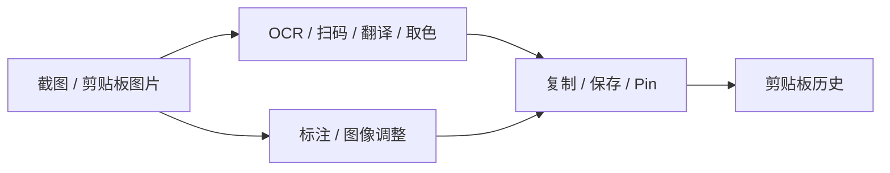

# PixPin 功能差距与 Clippy 后续路线

审阅日期：2026-09-18

代码基线：`dev` / `2383cc0cad00e4a07799d31e1b471e7c1ce6e568`

需求与路线标识：`PX-ROADMAP-2026-09`

## 目标

把 PixPin 解析得到的 168 项能力映射到 Clippy 当前代码，区分代码已经存在、安装后默认可用、
真实平台已经验收三种状态，并给后续功能建立可追踪的优先级、依赖关系和验收边界。

本报告只评价可观察行为、公开接口和 Clippy 自有实现。研究样本中的私有算法、模型和会员能力
不构成 Clippy 的产品需求，也不构成重新分发许可。

## 状态口径

| 状态 | 含义 |
|---|---|
| ✅ 已交付 | 有正常产品入口、生产实现和自动化保护；仍可能保留真机矩阵边界 |
| 🟡 能力存在 | 主链或开发运行时已经实现，但默认安装、格式覆盖、持久化或真实平台验收仍不完整 |
| ❌ 未实现 | 没有对应的产品领域、正常入口或生产数据链 |

“168 项”是参考能力的分类计数，不是 Clippy 的测试通过数。领域内只要存在关键交付缺口，
整栏就不能以一个勾号表示全部完成。

## 校正后的总表

| PixPin 域 | 项数 | 代码状态 | 默认交付 | 结论 |
|---|---:|---|---|---|
| 截图与选区 | 16 | ✅ | ✅ | 冻结帧、多屏、窗口探测、选区、`mode_gate` 和输出主链已接入；混合 DPI 与权限仍需真机矩阵 |
| 本地 OCR 与版面 | 20 | ✅ | 🟡 | PP-OCRv6 det/rec、EdgeGNN、逐框识别、CTC、结构化结果与 XY-cut 已实现；增强运行时和 Edge 模型未随安装包分发 |
| QR 与条码 | 8 | ✅ | ✅ | QR Code、Code 39、Code 128 与 EAN-13 的多结果、反色、旋转、坐标和资源合同已实现；未验收格式保持关闭 |
| 配置与本地操作 | 13 | ✅ | ✅ | 设置、版本迁移、自启动、快捷键、保存目标和更新器均有产品入口 |
| 长截图 | 15 | 🟡 | 🟡 | 固定选区、输入透明 guide、上下左右手动追加、回访保护、前接、撤销及 X11 自动滚动已实现；无 Wayland/Windows/macOS 自动输入 |
| 标注与图像效果 | 23 | 🟡 | 🟡 | 16 种工具及模糊、马赛克、聚光灯、放大镜、调色和圆角已接入；无语义智能擦除 |
| 贴图 / 历史 / 分组 | 29 | ✅ | ✅ | 临时 Pin 与用户保存的工作区已分离，支持布局恢复、分组、窄窗管理和独立全局历史浏览 |
| 本地导出与交换 | 12 | ✅ | ✅ | 单图扁平输出、旧 iTXt 兼容及带完整性校验的 `.clippy.zip` 历史/工作区批量交换已接入设置页 |
| 录屏 / 音频 / 编码 | 20 | 🟡 | ❌ | VP9/Opus 双轨容器与 Windows 音源已有受门控原型；平台音源尚未完整、双轨未接 session，X11/Windows/macOS/Wayland QA 入口与真机验收仍待闭环 |
| 动作 / 脚本 / 启动器 | 12 | 🟡 | 🟡 | 七个类型化动作、权限模型、键盘启动器与安全组合已交付；任意脚本运行时明确不在首阶段范围 |

原表的整体方向成立。当前校正重点包括：增强 OCR 是“实现完成、交付未完成”；扫码已完成四种
产品格式；录屏已有 X11/Windows 受门控 QA 入口但尚未默认交付；类型化动作与启动器已完成，任意脚本运行时不在
首阶段范围。

## 当前已经实现的功能链

### 截图、选区与长截图

普通截图由 `capture::CaptureManager` 持有冻结帧和覆盖层会话，平台后端完成多显示器采集，
`mode_gate` 保证普通截图与长截图不会同时占用捕获资源。选区可以复制、保存、Pin，或交给长截图
控制窗口。

长截图不是连续录屏。`capture/longshot/session.rs` 接收已裁好的相邻 RGBA 帧，
`estimate_translation` 估计四向位移，再由带有符号位置的 `LongshotCanvas` 合并新增区域。
当前控制器提供手动追加、X11 自动滚动、撤销与输出，所以它的准确描述是：

- 固定选区；
- 用户自行上下或左右滚动；
- 每次点击手动重采并追加；
- X11 可选择上下左右自动滚动，Stop/Esc 在当前步骤后暂停；
- 低纹理、低相似、歧义、无新增、过大位移和资源超限时保持原会话可重试；
- 最多 64 帧，并受像素和内存预算约束。

Wayland 尚未建立 RemoteDesktop/libei 指针会话，Windows/macOS 也未接自动输入，因此这些平台不会
展示自动入口。输入透明 guide 已纳入控制窗的隐藏/恢复/销毁生命周期；X11 自动链真机证据和四平台
真实透传验收仍未完成。

### 本地 OCR 与版面

`src-tauri/ocr-sidecar/` 已实现以下开发运行时：

```text
PNG
  → PP-OCRv6 small det
  → 原图文字框与大图 tile 合并
  → clippy-edge-features-v1
  → EdgeGNN 段落分组
  → Clippy XY-cut 阅读顺序
  → 原像素透视 crop
  → 可选 PP-LCNet 文字行方向
  → PP-OCRv6 small rec
  → greedy CTC
  → lines / paragraphs / pipeline / fallbackReason
```

Rust 侧 `ocr/enhanced.rs` 校验绝对路径、模型 SHA、运行脚本身份、输入输出预算和 deadline，
并复用全局并发许可、single-flight、取消与子进程回收。结构化结果还会校验坐标、行 ID、段落引用、
阅读顺序、引擎和 feature schema。增强失败可以在剩余统一期限内回退 Tesseract；预算和超时失败不会
再启动第二引擎。

交付缺口在运行时配置：增强 OCR 依赖 `CLIPPY_OCR_MANIFEST`、隔离 Python、公开 det/rec/字典，
以及用户已有且有权使用的 Edge 模型。仓库不打包权重，三平台安装器也没有安装和健康检查流程。
未配置时产品使用 Tesseract。因此 `docs/pixpin-analysis.md` 原先“当前仍只有 Tesseract、应先做
结构化后端”的判断已经失效；本地研究副本已同步到当前边界。

### QR 与条码

`code_detection.rs` 具备以下保护和行为：

- 灰度输入、缩放、坐标映射与有界输出；
- `TryHarder` 和 `AlsoInverted`；
- 一张图最多返回 32 个去重结果；
- 全局单并发限制；并发请求明确返回 `busy`，不会重复占用解码工作集；
- 查看器工具栏入口与快照身份校验。

生产 `possible_formats()` 显式返回 `QR_CODE`、`CODE_39`、`CODE_128` 与 `EAN_13`。Code 128 对应
物流/资产标签，EAN-13 对应商品码；两者都有独立标准位串 fixture、稳定 wire 名和前端标签。
Micro QR、UPC-A 等未验收格式仍不暴露，不能把 rxing 依赖支持的所有枚举自动算成产品能力。

### 标注、查看器与 Pin

共享标注核心定义了 16 种工具：裁剪、对象、橡皮、画笔、马克笔、矩形、椭圆、高亮、直线、
箭头、测量、文字、模糊、马赛克、聚光灯和放大镜。这里的“橡皮”删除编辑对象，
不执行内容感知修复或生成式补全，所以不能计作智能擦除。

图片查看器承担图片深度操作，使用无限画布、缩放和平移，并把 OCR、扫码、翻译、取色和绘制放在
同一工具栏。剪贴板侧边栏只负责快速预览和进入查看器；Pin 负责持续悬浮参考。两者职责不同，
图片预览仍有必要，但复杂工具继续集中在查看器。

`PinManager` 使用进程内 `HashMap<String, PinEntry>` 持有打开的窗口。用户明确保存后，工作区表记录
内容引用、分组、布局和显示器身份，并在应用重启后恢复；关闭未保存的临时 Pin 仍只移除进程状态。
编辑状态由本机根资产和累计文档恢复，旧 iTXt 只保留兼容导入。独立全局工作区历史浏览器使用轻量
摘要和按需缩略图，可重新显示、聚焦、归组或移除已保存 Pin，不改变主窗口“收藏 / 全部”页签。

### 导出、录制与动作

图片输出覆盖剪贴板、单文件 PNG、另存为和扁平导出；正常 PNG 不携带根图。设置页的本地数据交换
可按全量、仅收藏或仅 Pin 工作区导出 `.clippy.zip`，并在导入前校验 manifest、哈希、PNG、修订重放
和关系，再用单个事务合并历史并追加工作区。它是显式工程/集合协议，不改变粘贴图片仍是扁平像素的语义。

录屏已建立单调时间线、三槽背压、恢复 journal、VP9/WebM 原型、X11/Windows/macOS/Wayland 帧源、
控制窗和结果/恢复库。结果窗可在完整校验后用不透明租约按需播放 WebM；异常 VP9/WebM 分段还能
逐 packet 无损 remux 为一个完整结果，全程不把真实路径交给前端。VP9 结果卡在接近视口时可从
私有持久缓存加载首帧缩略图，冷缓存由同一受限 WebM 合同校验并单帧解码。产品入口只在显式
feature 的原生 X11 与 Windows QA 构建开放，默认 release、Wayland 与 macOS 保持关闭。双轨
schema v2 已能原子记录 Opus 格式与每个产物的 packet/真实 PCM frame 统计，并让结果库安全展示
完整或中断的双轨产物；系统音频、麦克风、双轨 session writer、双轨异常 remux 和各平台真机矩阵
尚未完成。

类型化动作目录、权限声明、一次性句柄、键盘启动器和安全组合已经交付；任意脚本宿主与插件市场仍不在
首阶段范围。

## 产品方向

Clippy 当前最完整的闭环是：



后续投入应先把这条闭环变成三平台默认可靠能力，再扩展 Pin 工作区与批量交换。长截图的方向增强
建立在现有会话和像素预算上。录屏会新增持续采集、音频、编码、恢复和隐私权限五个领域，适合独立
里程碑。动作系统先建立类型化动作与权限，再评估脚本运行时。

## 2026-09-18 质量与数据模型决策

本节把后续实现收敛到五条可独立验收的链路。它同时修正两个容易造成错误实现的概念：

1. `EdgeGNN` 的 Edge 是文字框图中的“边”，不是图像边缘增强。`edge_features.py` 把检测框作为
   节点，把相邻框的距离、重叠、对齐、高度比和颜色差作为边特征；模型输出用于段落分组，Clippy
   再用 XY-cut 决定阅读顺序。它不锐化笔画，也不直接提高单字置信度。
2. PP-OCR 的检测结果是文字区域/行四边形，逐框透视裁切的作用是减少背景、倾斜和尺度干扰；
   它不等于逐字符检测。中英日混排、连续空格、数字、符号和二维公式仍由识别模型的训练覆盖、
   字典、CTC 解码和专用公式模型共同决定。

### OCR 调研结论

当前增强链在结构上比单次整图 Tesseract 更适合复杂截图：它先检测文字区域，再从原始像素做透视
裁切，并保留框、行、段落和阅读顺序。仓库已有 14 张同源合成图 A/B：增强链原始 CER 0.34%、
空白 F1 0.990，Tesseract 分别为 32.70% 和 0.765；证据与限制见
[`2026-09-18-ocr-quality-baseline.md`](2026-09-18-ocr-quality-baseline.md)。该样本证明当前管线在这些
布局上的优势，仍不能替代真实混合语言、复杂符号、公式、拍照畸变与各平台字体语料。

Clippy 当前使用 PP-OCRv6 small det/rec、18,708 项公开字典和额外 ASCII 空格类。字典包含常见中日
字符、拉丁字母、数字和大量数学符号，说明这些码点可以被解码；字典覆盖不代表模型一定能正确识别。
当前 greedy CTC 会合并相邻重复类别，只有 blank 才能分隔重复字符，所以窄空格、连续相同字符和
低置信间隔必须进入专项语料。公式也不能只靠字符序列恢复分数、上下标、根式和矩阵的二维结构；
PaddleOCR 官方把公式识别作为 PP-FormulaNet/UniMERNet 独立模块，Clippy 应采用显式公式路由，不能
把普通 OCR 文本伪装成 LaTeX。

v1 固定语料已完成增强链实跑：检测 Hmean 1.000、阅读顺序错误率 0、去空白 CER 1.18%，但原始
CER 13.30%、空白召回 56.1%。逐字符 CTC 诊断证明长 blank-run 不能直接等价为空格：中日文字形也
会产生长 blank，连续双空格又常被压成一个 space class。因此当前瓶颈在通用识别模型的空白保真，
不是 EdgeGNN 或检测框；不增加猜测性 blank-run 补空格。

英语专用模型 A/B 已落地为可选质量档。安全融合要求英语候选保持全部非空白码点，仅允许增加模型
实际识别到的空白；混合 v1 的空白 F1 从 0.719 提升至 0.787，去空白 CER 不变，但 P50 从 340.74 ms
升至 786.31 ms，且连续双空格仍大量漏失。因此它通过 `--english-spacing` 显式启用，不替换默认链。

### `PX-OCR-ORIENTATION-01` 文字行方向与透视裁切

**Goal**：让增强 OCR 在截图内的横排、倒置和竖向文字框上使用同一条可解释的逐框方向链，且未配置
方向模型时保持现有输出与耗时边界。

**Requirements**：

1. 检测四边形仍从原始像素做透视展开；高窄框先按几何固定旋成横向，不缩放 DOM 坐标或改写返回框。
2. 方向判断采用固定版本的官方 `PP-LCNet_x0_25_textline_ori` ONNX。该模型只区分 0°/180°；
   90°/270°由上一条几何归一化覆盖，不用四次文字识别置信度代替方向分类。
3. 方向模型是显式可选资产，按 manifest SHA 校验并惰性加载。只有 180°类别达到固定保守阈值时
   才翻转；模型缺失时不改变默认多语言识别链。
4. 逐框方向推理计入统一 deadline 和 crop 预算；输出 shape、非有限值或概率范围异常必须明确失败。
5. 产品结果保留原检测框；仅显式 diagnostics 记录几何旋转、方向类别、分数和最终旋转角度。

**Acceptance Criteria**：固定 SHA 的 0°/90°/180°/270°合成截图均能保持检测框并恢复同一文字；
未启用方向档的现有基线不变；错误模型合同、篡改 SHA 和过期 deadline 有自动化保护；A/B 报告同时
记录 CER、检测、方向结果与 P50/P95，不能只用单张成功截图宣称完成。

**Out of Scope**：整页文档方向分类、拍照文档去畸变、任意曲面文字、竖排语言版式重排，以及
PP-FormulaNet/UniMERNet 的二维公式恢复。

实现状态：可选方向档已接入；固定四向语料中检测 Hmean 保持 1.000，原始 CER 从 43.75% 降至 0%，
4/4 case 完全匹配。该结果只证明合成截图合同，真实旋转 UI 和三平台 CPU 性能仍属于交付验证。

### `PX-OCR-MODEL-TIER-01` 检测与识别模型档位

**Goal**：分别判断 det 与 rec 升档是否改善 Clippy 的复制文本和结构化框，避免用官方总分或单一 CER
直接替换当前 small 链。

**Requirements**：small/medium det 与 rec 必须组成四组独立 A/B；每组使用相同原图、阈值、
Edge 模型和评测器；同时报告检测 Hmean、原始/去空白 CER、空白 F1、精确 case、P50/P95、文件大小
和峰值内存。中英日、代码、金额、易混淆编号、表格和公式必须分标签查看。研究 manifest 不得被 Rust
产品配置接受，模型权重不得进入仓库。

**Acceptance Criteria**：只有目标分层改善、关键分层无回退、表格阅读顺序正确、单模型/总 RSS 预算
明确且三平台 CPU 可接受时，才为设置页增加产品档位。检测拆成 cell 后若当前结果合同无法表达行/表格
关系，应先扩展结构合同，不能把更多框自动解释为更准。

**Out of Scope**：本阶段不提高产品 64 MiB 单模型上限，不默认下载 medium，不把线性公式文本算作
LaTeX/MathML，也不使用私有 PixPin 模型或指标。

实现状态：固定官方四组 A/B 与 UI 压力语料已经完成。medium rec 在英语专项改善，但在混合/UI 原始
CER 和空白上回退；medium det 将表格行拆成 cell 后破坏当前排序，且延迟约为 small 的 1.8–2.7 倍。
因此本轮结论是保留 small 默认并拒绝直接升档；原始报告见 OCR 质量基线。

### `PX-OCR-TABLE-01` 表格行与单元格结构合同

**Goal**：让整行框和拆分 cell 的检测结果都能按各自粒度公平评测，并确保复制文本始终保持
row-major 顺序，避免金额、编号或表头因微小纵坐标差异错列。

**Requirements**：表格真值必须显式保存 table/row/cell/columnIndex 与原图四边形；raw cell 检测和
几何聚合后的 row 检测分别计分；产品原始顺序与仅按框几何重建的顺序分别计算 inversion 和非空白
CER。任何排序修复只能使用检测框几何，不能读取真值、OCR 文字或表格关键词，也不能改变框坐标和
识别字符。

**Acceptance Criteria**：固定表格样本能证明整行 small 与拆框 medium 都达到 row Hmean 1.000；
medium 当前输出中的错列必须由 raw inversion/CER 捕获，几何重建应恢复 row-major 且非空白 CER 为
0；相同基线存在 1–2px 抖动时仍按 x 排序，不同行、双栏和既有分组测试不得回退。

**Out of Scope**：本阶段不导出 HTML/CSV/XLSX，不恢复 rowspan/colspan、边框或空白单元格，不把
评测时的真值行归属带入产品，也不因此启用 medium 模型。

实现状态：已完成。独立 `table-corpus-v1` 与双层评测器已建立；固定证据显示 small/medium row Hmean 均为
1.000，medium det 的 raw 顺序有 1 次 inversion、非空白 CER 17.39%，而同一批框按几何重建后 CER
为 0。同基线稳定排序接入后真实 sidecar 重跑为 0 inversion、0% CER，既有双栏和分组回归保持通过。

官方资料还给出三个与实现直接相关的边界：

- PP-OCRv6 small recognition 是单模型 50 语言路线，但官方指标来自其内部数据集，不能直接外推到
  Clippy 的剪贴板截图；medium 模型精度更高但包体与运行资源也更大；
- 官方另有英语专用模型并明确强调空格遗漏改善，说明通用多语言模型的空格保真必须单独测量；
- 官方 OCR pipeline 把整页方向、去畸变和文字行方向分为独立模块。Clippy 已接入可选的两类文字行
  方向模型；整页方向与拍照去畸变仍未实现，也不应被四向合成行语料冒充。

资料：

- [PP-OCRv6 技术说明](https://github.com/PaddlePaddle/PaddleOCR/blob/main/docs/version3.x/algorithm/PP-OCRv6/PP-OCRv6.en.md)
- [PaddleOCR 文字识别模块](https://github.com/PaddlePaddle/PaddleOCR/blob/main/docs/version3.x/module_usage/text_recognition.en.md)
- [PaddleOCR OCR pipeline](https://github.com/PaddlePaddle/PaddleOCR/blob/main/docs/version3.x/pipeline_usage/OCR.en.md)
- [PaddleOCR 公式识别模块](https://www.paddleocr.ai/main/en/version3.x/module_usage/formula_recognition.html)

### OCR 优化顺序

OCR 先建立可重复评测，再改变模型或后处理。评测保留原始 Unicode 和空白，至少分别报告：检测框
precision/recall/Hmean、原始码点 CER、去空白 CER、空白 precision/recall/F1、整行完全匹配率、
阅读顺序错误、公式结构准确率、端到端耗时和峰值内存。不得只用去空白或统一标点后的结果掩盖复制
文本的真实差异。

语料按以下维度分层并保留来源/许可：中英混排、中日混排、三语混排、连续与全角空格、重复字符、
整数/小数/百分比/货币/日期/序列号、成对与全半角标点、常用数学符号、代码、表格、多栏、旋转、
低对比/缩放/压缩、竖排和独立公式区域。每个样本保存原图、文字框、逐行文本、段落与阅读顺序；
公式样本另存结构化真值。

优化阶段按评测证据推进：

1. 固定当前 Tesseract 与 PP-OCRv6 small 基线，不改阈值；
2. 分开定位检测漏框、裁切/方向、字符识别、CTC 空白和版面排序问题；
3. 先调检测/裁切和方向，再 A/B small 与 medium 或语言专用模型；
4. 对连续空格和重复字符评估 beam/word-boundary 后处理，但原始结果始终可追溯；
5. 公式检测后走独立公式识别器，普通文字仍走 PP-OCR；
6. 只有固定语料中目标分层改善、其他关键分层不回退且资源预算满足时才替换默认链。

### 截图快捷工具与二维长截图

普通截图工具条已经有长截图按钮。本阶段保留该入口，并增加 QR/条码按钮；扫码直接读取当前
`capture session + selection revision` 对应的冻结原图选区，不先写入 clips，也不读取带标注的合成图。
返回结果必须绑定请求代次，用户改变选区后晚到结果不得显示。结果浮层支持多码、格式和主动复制；
疑似链接仍按普通文本显示，不自动打开，识别失败不关闭截图。

进入长截图后，原截图覆盖层结束，现有控制器让底下窗口可以由用户滚动。选区边界由只绘制边框且
原生输入透传的全屏 guide window 持续显示，冻结覆盖层不会继续拦截滚轮；控制器仍负责
开始、暂停、撤销、完成和错误恢复。第一阶段是手动滚动和采样，不做系统级输入注入。

二维拼接不把“反向滚动”解释为静默裁掉已完成内容。会话保存不可变帧及其有符号全局位置：

- 向下/右出现新区域时扩展底部/右侧；
- 向上/左越过已有边界时前接顶部/左侧；
- 回到已覆盖区域时只更新当前 viewport anchor，不修改已提交像素；
- “撤销”显式移除最近一次帧提交，“裁剪”由用户在完成前明确执行；
- 位移估计必须区分水平/垂直主轴并有滞回，歧义、动态内容和固定页头失败保持原结果可导出。

最终画布以所有已提交帧的 union bounds 物化，像素预算、帧数、混合 DPI 和显示器身份仍受现有
`mode_gate` 与会话所有权保护。自动滚动在二维手动主链稳定后再做，并按平台探测输入权限、焦点、
停止键和页面到底条件。

### 标注与图像效果质量

现有 16 个工具先建立同一源图上的前端预览/Rust 权威导出对照，覆盖 1x/1.25x/2x DPR、透明边缘、
极细/极粗笔画、裁剪边界和多次编辑。重点检查模糊邻域裁切、马赛克格边界、箭头与测量端点、文字
字体差异、放大镜插值、圆角 alpha、聚光遮罩以及旋转/缩放后的坐标稳定性。改动必须从不可变原图
按源像素坐标重绘，不能从上一次屏幕预览继续采样；黄金图、PSNR/像素差和人工视觉样本共同验收。

“橡皮”继续表示删除标注对象。内容感知擦除是独立能力，必须先满足许可、包体、延迟和失败可撤销
条件，不能用模糊或背景色覆盖冒充。

### 内部可编辑图片修订链

用户期望的是应用内部管理的无损修订，不是每次保存一个重复携带原图的自包含 PNG。该模型合理，
但“指针”必须是数据库内稳定的内容地址 ID，不能是临时文件路径，也不能只指向会被历史清理的
`clips.id`。

实现数据模型：

```text
image_assets
  asset_id, SHA-256(canonical source PNG), immutable PNG/blob, dimensions

image_revisions
  revision_id, root_asset_id,
  canonical_document(源像素坐标的累计标注/调整), rendered_hash, renderer_version

clip_image_revisions
  clip_id → revision_id
```

当前阶段每个 revision 已保存完整累计 document，因此重开不依赖父链；显式 project、parent DAG、
Pin 工作区和分组留给 `PX-PIN-01`。根图仍只存一次，功能语义不依赖 `clips.id` 或文件路径。

保存流程严格是“从根图渲染”，不是“从上次渲染图继续画”：原图 1 只存一次；保存修订 2 时写入
`root 1 + document 2`，生成无损 PNG 2；再次编辑修订 2 时加载根图 1 和 document 2，保存为
`root 1 + document 3`，生成 PNG 3。本阶段的 `document 3` 是规范化累计文档，读取不需要重放无限
delta；父链与项目历史留给 `PX-PIN-01`。显式 resize/crop 之外不重采样，PNG 输出和源像素坐标
保证代际间没有画质损失。

剪贴板只复制渲染 PNG，不携带未打码原图和编辑操作。Clippy 自己重新收到完全相同的 PNG 时，可按
规范化像素哈希恢复其 `image_revision_id`；仅改变 PNG 压缩/chunk 而像素完全相同仍可恢复，缩放、
有损转码或任一像素修改后按普通图片处理。文件级跨设备继续编辑将在 `PX-IO-01` 提供显式工程
归档；现有自包含 iTXt PNG 当前只作为兼容
导入格式，不再是默认内部保存格式。

清理采用外键加可达性，而不是手工引用计数猜测：当前只要 revision 仍可达根 asset，根图就禁止
删除；未来 project 或保存的 Pin 工作区同样通过外键引用。删除一个
剪贴板条目不能破坏仍被后续修订引用的根图。迁移现有 iTXt 工程时解出根图、规范化 document 和
当前渲染图，校验哈希后一次性导入新结构；损坏工程仍退回扁平 PNG。

## 实施顺序

| 阶段 | 路线 ID | 内容 | 依赖 |
|---|---|---|---|
| P0（已完成） | `PX-OCR-QUALITY-01` | 混合文字/空白/符号/公式质量语料、指标与双引擎基线 | 当前 OCR 输出合同 |
| P0（已完成） | `PX-OCR-ORIENTATION-01` | 可选逐框 0°/180°分类与四向固定语料 | `PX-OCR-QUALITY-01` |
| P0（已完成调研） | `PX-OCR-MODEL-TIER-01` | small/medium det/rec 四组 A/B；当前不升档 | `PX-OCR-QUALITY-01` |
| P0（已完成） | `PX-OCR-TABLE-01` | row/cell 双层真值、错列检测与稳定同基线排序 | `PX-OCR-MODEL-TIER-01` |
| P0（已完成） | `PX-OCR-01` | 基于基线完成增强 OCR 安装、健康检查、许可与模型选择 | `PX-OCR-QUALITY-01` |
| P0（已完成门控，产品 no-go） | `PX-OCR-FORMULA-01` | 独立公式 crop、PP-FormulaNet A/B 与自动路由探针 | `PX-OCR-QUALITY-01` |
| P0（已完成） | `PX-CAPTURE-TOOLS-01` | 冻结选区快捷扫码；保留现有长截图入口 | capture session 身份 |
| P1（待原生 QA） | `PX-LS-2D-01` | 上下左右拼接、viewport 回访、显式撤销与输入透明 guide 已实现 | 真实长截图 fixture |
| P1（已完成） | `PX-ANNOTATION-QUALITY-01` | 16 工具预览/导出画质矩阵与逐项修正 | 权威 Rust 渲染器 |
| P1（已完成） | `PX-IMAGE-REVISION-01` | 内容寻址根图、累计修订、渲染 clip 关联与安全清理 | 数据库迁移设计 |
| P1（已完成） | `PX-PIN-01` | 基于 image project 的 Pin 工作区、历史恢复和分组 | `PX-IMAGE-REVISION-01` |
| P1（已完成） | `PX-PIN-HISTORY-01` | 独立全局工作区历史浏览、重开、归组与移除 | `PX-PIN-01` |
| P1（已完成） | `PX-IO-01` | 工程归档与批量导出/导入 | image project/clipboard 数据版本 |
| P2（X11 已实现，待真机） | `PX-LS-AUTO-01` | X11 受控自动滚动；其余平台能力保持不可用 | `PX-LS-2D-01` + 平台输入能力 |
| P2（已完成） | `PX-CODE-01` | 四种产品格式与扫码场景矩阵 | 可重复 fixture |
| P2（X11/Windows/macOS/Wayland QA 入口、结果库、播放与恢复 remux 已完成，待真机/音频） | `PX-REC-01` / `PX-REC-PLAYBACK-01` / `PX-REC-MERGE-01` / `PX-REC-WINDOWS-QA-01` / `PX-REC-MACOS-SCK-01` / `PX-REC-WAYLAND-QA-01` | 可恢复录屏最小闭环 | 平台采集/编码实测 |
| P2（内部可恢复双轨 session 已完成，待平台音源产品接线/其余平台） | `PX-REC-CLOCK-01` / `PX-REC-AUDIO-01` / `PX-REC-AUDIO-WORKER-01` / `PX-REC-WINDOWS-AUDIO-01` / `PX-REC-AV-EPOCH-01` / `PX-REC-OPUS-WEBM-01` / `PX-REC-AV-MANIFEST-01` / `PX-REC-AV-SESSION-01` | 单一会话时钟、48 kHz PCM、显式 A/V 起点、有界双轨排序、参考 Opus、周期可恢复双轨容器与版本化统计 | `PX-REC-01` 视频时间线 |
| P3（已完成） | `PX-ACT-01` | 类型化动作注册表与启动器 | 稳定业务命令合同 |
| P3（已完成门控，当前 no-go） | `PX-SMART-01` | 智能擦除可行性与质量基线 | 模型许可、包体和性能预算 |

## 路线需求与验收边界

### `PX-OCR-QUALITY-01`：OCR 质量基线与分层优化

**Goal**：用同一批有框、有文本、有顺序的样本判断检测、识别、版面和公式链是否真实改善。

**Requirements**：

- 建立版本化语料 schema，保留原始 Unicode、空格、框坐标、行/段落顺序、语言/场景标签和许可；
- 同一输入记录 Tesseract 与增强链输出，不以单一总分覆盖分层退化；
- 指标至少包含检测 Hmean、原始/去空白 CER、空白 F1、整行匹配、阅读顺序、耗时与内存；
- 普通文字与结构化公式分开评测，公式引擎缺失时明确记为 unsupported。

**Acceptance Criteria**：

- [x] 评测器对 Unicode、连续空格、重复字符、符号、框匹配和阅读顺序有确定性单元测试；
- [x] 首批自有/可再分发语料覆盖中英日混排、数值、符号、空格和公式路由；
- [x] 当前 Tesseract 与 PP-OCRv6 small 在同一机器形成可复现基线报告；
- [x] 任一模型/阈值或版面规则替换均报告目标分层改善、关键分层回退和资源变化。

**2026-09-21 诊断状态**：v1 增强链基线与有界 CTC 发射证据已固化；普通产品请求不承担诊断对象
开销。英语专用 rec、文字行方向和 small/medium det/rec 四组 A/B 已分别记录质量与耗时；模型档位
报告另补 Linux 独立进程峰值 RSS。Firefox 栅格化的暗色 UI、代码/斜体、票据表格与长图语料已按
同一资产身份运行 Tesseract 与增强链；规则表格从列优先改为行优先后，目标层、暗色/代码回退和资源
变化均保存前后证据。medium 的分层回退与工作集增长仍不满足默认升档条件。独立公式门禁也已完成：
PP-FormulaNet-S/plus-S 各有 1/6 不可解析结果、权重约 232–257 MB、Linux 峰值约 0.9 GiB，
PP-DocLayout-S 在当前 crop 正样本召回为 0，因此产品和自动路由均保持 no-go。下一步是真实拍照/
压缩来源、整页公式路由语料以及 Windows/macOS 同源资源复测；仍不支持仅凭 blank-run 阈值改写
复制文本。

**Out of Scope**：用单张 PixPin 样本宣称总体精度、静默改写用户文本、把普通 OCR 当公式识别。

### `PX-OCR-FORMULA-01`：独立公式识别与自动路由门禁

**Goal**：验证明确公式区域能否输出真正 LaTeX，并把公式识别质量与公式区域检测、普通 OCR 和资源
预算分开决策。

**Acceptance Criteria**：

- [x] Firefox MathML 固定 crop 覆盖分数、根式、上下标、积分/求和、希腊字母、矩阵和分段函数；
- [x] PP-FormulaNet-S 与 plus-S 使用固定官方 revision/SHA 实跑并报告严格 token、可解析率、延迟和 RSS；
- [x] PP-DocLayout-S 自动路由探针分开报告正样本召回和无公式 UI 误报；
- [x] 权重、研究 venv 和本机路径不入库，普通 OCR 继续明确 `structuredFormula=false`；
- [x] 产品结论为 no-go：不提高 64 MiB 默认预算，不添加未达门禁的显式或自动入口。

详细逐 case 结果和下一门禁见
[`2026-09-21-ocr-formula-feasibility.md`](2026-09-21-ocr-formula-feasibility.md)。

### `PX-CAPTURE-TOOLS-01`：冻结选区快捷长截图与扫码

**Goal**：让用户在截图选区完成后直接进入长截图或识别 QR/条码，无需先保存到历史或打开查看器。

**Requirements**：扫码读取权威冻结帧的当前选区；请求绑定 session 和 selection revision；结果浮层支持
多码、格式和主动复制，内容不自动打开；长截图继续使用现有入口和会话所有权。

**Acceptance Criteria**：

- [x] 扫码命令不能读取其他 capture session，也不能绕过覆盖层 IPC 白名单；
- [x] 改变选区或关闭截图后，晚到扫码结果被丢弃；
- [x] QR、Code 39、多码、反色、无结果和超限 fixture 均不关闭覆盖层；
- [x] 长截图按钮继续从同一选区启动，扫码失败不影响复制/保存/Pin。

**Out of Scope**：第一阶段不新增未经 fixture 验证的条码格式，不扫描标注后的图像。

**实现状态（2026-09-18）**：覆盖层工具栏直接提供扫码与长截图；扫码从 `CaptureManager` 的权威
冻结帧裁切，并同时核对调用窗口、session、显示器和选区。前端以 session、monitor 和几何生成
selection identity，移动选区、取消、输出或卸载都会使晚到结果失效。IPC 白名单仅向截图覆盖层开放
该命令；扫码失败后普通复制、保存和 Pin 仍可继续。长截图沿用同一 selection 和原有两阶段 handoff，
没有另建可伪造的选区来源。

### `PX-LS-2D-01`：二维手动长截图

**Goal**：允许用户直接滚动原窗口，并把上下左右出现的新区域无损拼入同一画布。

**Requirements**：使用目标显示器全屏透明、原生输入透传的 guide 标记区域，避免依赖 Wayland 禁止的
客户端小窗定位；guide 必须使用冻结帧的显示器几何和实际物理裁剪区反算边框，每次重捕获前与控制窗
一起隐藏，恢复、终止和异常清理时作为同一窗口组处理。会话记录不可变帧、有符号位置、viewport
anchor 和可撤销提交；回访已覆盖区域不删像素；上下左右扩展统一受像素/内存预算约束。

**Acceptance Criteria**：

- [x] 下→上回访→继续下、右→左越界、上方前接和二维转向 fixture 得到确定像素结果；
- [x] 回访、歧义、低纹理、动态固定区域和错误方向不会静默裁掉已提交内容；
- [x] 撤销只移除最后一次提交，失败后原结果仍可复制/保存/Pin；
- [x] guide 请求原生鼠标/滚轮透传，重捕获前与控制窗成组隐藏，控制窗销毁后成组清理；
- [ ] X11、Wayland、Windows、macOS 分别验证滚轮透传、guide 位置和混合 DPI。

**Out of Scope**：系统输入注入、浏览器 DOM 控制、无限画布内存和隐式反向裁剪。

**2026-09-18 实施状态**：会话已改为不可变帧、带符号位置、viewport anchor 和 union bounds；
一维评分核心经旋转/反向复用于四方向候选，并用主轴滞回避免轻微噪声反复换轴。回访只更新 anchor，
最早提交像素在重叠区保持权威；控制窗提供显式撤销，并显示画布总宽高。帧存储与最终画布的原始
字节合计受 256 MiB 上限约束。普通截图覆盖层在 handoff 后退出；目标显示器全屏 guide 使用冻结帧
显示器几何和实际物理 crop 反算逻辑边框，并请求原生输入透传。guide 与控制窗构成同一生命周期组，
追加前共同隐藏、完成后共同恢复，创建失败、deadline、取消和原生销毁均共同清理。前端拒绝缺失、
非有限、空、负数或越出显示器的边框参数。四平台滚轮透传与混合 DPI 仍需原生 QA，不能把最后一项
平台验收记为通过。自动滚动仍留在 `PX-LS-AUTO-01`。

### `PX-ANNOTATION-QUALITY-01`：标注与效果画质

**Goal**：让编辑预览与权威导出在各缩放比例下保持可预测，并消除重复编辑造成的画质损失。

**Requirements**：建立 16 工具、效果、DPR、alpha 和边界黄金样本；每次导出从不可变根图按源坐标渲染；
记录前端预览与 Rust 输出允许差异（例如字体栅格化）。

**Acceptance Criteria**：

- [x] 每个工具至少有正常、边界和高 DPI fixture；
- [x] 模糊、马赛克、放大镜、圆角和聚光灯覆盖透明边缘与相邻像素；
- [x] 连续保存/重开不会积累缩放、压缩或坐标误差；
- [x] 差异超出已登记容差时测试失败并输出可审阅图片。

**Out of Scope**：智能擦除与生成式补全。

**2026-09-18 实施状态**：真实 Firefox Canvas 已覆盖 13 种会产生像素的工具在普通位置、边界
位置和 1×/2× DPR；select/object/eraser 以缩放后的 CSS 坐标、边界钳制和撤销粒度覆盖。
Rust 金图继续约束权威输出。修复了模糊、马赛克和放大镜双线性采样直接平均直通 RGBA 导致
透明像素隐藏颜色渗入的暗边/彩边；预览马赛克同步采用预乘 alpha。对象外接框现在包含笔宽、
箭头、测量装饰与 CJK 文字，移动到边缘不再裁掉可见笔画。新增三轮累计文档保存/重开回归：
每一轮都校验根 PNG 字节未变、源像素小数坐标 JSON 未变、落盘与剪贴板 RGBA 完全一致，并从根图
重放得到相同权威输出。64×48 组合金图以零通道差、零超差像素作为登记容差；超差会在
`src-tauri/target/test-artifacts/pin-render-v2/` 输出 expected、actual、diff 三张 PNG，容差与人工
更新规则记录在 fixture README。该需求的代码级验收已完成；三平台本机观感仍归入 `PX-BASE-01`。

### `PX-IMAGE-REVISION-01`：内部无损图片修订链

**Goal**：根图只保存一次，每个可编辑版本引用根图与规范化编辑文档，同时提供可粘贴的扁平 PNG。

**Requirements**：新增不可变 asset、累计 revision 和 clip 关联；每次从根图渲染；剪贴板只输出渲染图；
清理基于外键可达性；兼容导入现有 iTXt 工程；跨设备归档留给 `PX-IO-01`。

**Acceptance Criteria**：

- [x] “原图 1→修订 2→修订 3”数据库中只有一份根图，两个 revision 都能独立重开；
- [x] PNG 2 的规范化像素回流能恢复 revision 2，像素变化后安全退回普通图片；
- [x] 删除任一 clip、运行历史清理或应用重启都不会删除仍可达的根图；
- [x] PNG 3 由根图 1 与累计 document 3 渲染，像素测试证明没有从 PNG 2 二次采样；
- [x] iTXt v2/v3 可迁移，损坏/未来版本只导入扁平 IDAT；事务失败不留下孤儿 asset/revision。

**Out of Scope**：默认把未打码原图放进系统剪贴板、依赖文件路径、云同步、跨设备归档，以及
面向用户的修订删除/配额管理；这些持久修订在提供显式管理入口前不会被历史清理误删。

**2026-09-18 实施状态**：新增 `image_assets`、`image_revisions`、`clip_image_revisions` 与
`clips.image_asset_id`。普通根图片段在首次编辑时原子迁入 asset；每个保存版本记录累计文档和
规范化渲染哈希，watcher 插入对应扁平 PNG 时在同一事务自动回链。查看器和 Pin 分别持有当前
预览与唯一根图：OCR/扫码读取预览，画布从根图重放；复制、文件保存和系统剪贴板都不再嵌入原图。
根 asset 由 revision 外键保护，历史清理不影响恢复。旧 iTXt v2/v3 继续严格校验并在下一次保存
或复制时迁入；未来显式跨设备归档属于 `PX-IO-01`。

### `PX-BASE-01`：现有能力真实平台验收

**Goal**：证明已经实现的高级能力在支持平台的真实桌面上可重复完成。

**Requirements**：

- 使用同一构建 SHA 验证截图、手动长截图、查看器、OCR、扫码、Pin 工程重开；
- 覆盖 Linux X11、至少一个 Wayland compositor、Windows、macOS；
- 记录权限拒绝、混合 DPI、多显示器、动态页面和大图预算结果。

**Acceptance Criteria**：

- [ ] 每个平台按 `docs/native-qa.md` 保存构建 SHA、安装包和逐场景结果；
- [ ] 长截图保存结果能以像素或稳定视觉 fixture 复核接缝；
- [ ] 未执行和失败项保持未完成，不由单元测试替代。

**Out of Scope**：自动滚动、横向长截图、新条码格式和新模型。

### `PX-OCR-01`：增强 OCR 产品化

**Goal**：让用户能判断增强 OCR 是否可用，并通过受控流程安装或配置它。

**Requirements**：

- [x] 设置页展示当前引擎、模型身份、健康状态、回退原因和缺失项；
- [x] 固定公开模型来源、SHA、许可证和更新策略；
- [x] Edge 模型的取得和分发必须先完成许可决策；当前决策是只引用用户已有且自行核权的本地模型，
  不下载、不复制、不随安装包分发；
- [x] 配置、替换和清除 manifest 均不得破坏 Tesseract 回退。

**Acceptance Criteria**：

- [x] 全新安装在没有增强运行时时明确显示 Tesseract 状态；
- [x] 有效 manifest 能通过 UI 健康检查并完成结构化多行 OCR；
- [x] 坏模型、错误 SHA、缺 Python、超时和取消均给出稳定错误且无残留进程；
- [x] 三平台安装策略和包体变化有记录，未支持的平台不显示为已安装。

**Out of Scope**：复制参考产品的私有权重、训练模型、在线 OCR 和无依据的文字纠错。

**实现记录（2026-09-18）**：

- `AppConfig.enhanced_ocr_manifest_path` 保存用户选择；运行时优先使用设置值，空值才允许
  `CLIPPY_OCR_MANIFEST` 作为开发环境兜底。选择文件只改变表单，按设置页 Save 后才切换实际识别配置；
- `ocr_health_status` 与真实识别共用 `enhanced.rs::load`，同时复核 manifest 合同、Python、sidecar
  模块、四个必需资产及两项可选英语资产的路径/大小/SHA，并探测 Tesseract fallback。前端只依赖
  稳定枚举码，不解析后端日志文案；
- 设置页显示当前引擎、pipeline ID、det/rec/dictionary/edge SHA 前缀、Tesseract fallback 与具体缺失角色。
  无增强运行时时显示 `Tesseract`，坏增强配置且 Tesseract 可用时显示 fallback，二者都不可用才显示
  unavailable；
- Linux 保留显式 `pkexec apt-get` 的 Tesseract 安装入口；Windows/macOS 仍交给各自系统安装方式。
  三个平台的增强链都采用用户准备隔离 Python + 固定 manifest 的配置策略，只有同一套真实文件和哈希
  校验通过才显示 ready。当前未发布三平台增强运行时安装器，也未把 Python、wheel 或模型加入安装包，
  因而运行时/模型包体增量为 0；应用代码自身的最终安装包字节变化留待发布构建记录；
- 公开 det/rec/dictionary 继续使用 `setup_models.py` 中的固定 URL、commit 和 SHA。Edge 模型没有完成
  可再分发许可证明，因此 UI 不提供“自动安装增强 OCR”，避免把本地可加载误写成产品已安装；
- 状态单测覆盖 ready、Tesseract-only、坏模型哈希与具体资产角色；既有进程监督测试覆盖超时、取消、
  输出上限、kill/wait 和许可释放，真实增强多行识别证据沿用
  `docs/reviews/2026-09-18-ocr-quality-baseline.md`。

### `PX-PIN-01`：Pin 工作区、历史与分组

**Goal**：恢复用户主动保存的贴图布局，并让多张参考图可以按任务组织。

**Requirements**：

- 持久化内容引用、位置、缩放、透明度、锁定、置顶、组 ID 和显示器身份；
- 区分临时 Pin、保存到工作区和内部 image project；
- 根图与修订引用复用 `PX-IMAGE-REVISION-01`，窗口标签不作为持久主键；
- 显示器缺失或 DPI 改变时执行可预测的位置恢复。

**Acceptance Criteria**：

- [x] 应用重启后只恢复用户保存的工作区；
- [x] 关闭临时 Pin 不会生成历史记录；
- [x] 显示器拔插后窗口全部回到可见区域；
- [x] 数据迁移、删除组和损坏记录具有自动化测试。

**Out of Scope**：云同步、多人共享和无限历史。

**实现记录（2026-09-18）**：

- 新增 `pin_workspace_items` 与 `pin_groups`。临时 Pin 继续只存在于 `PinManager`，只有用户点击
  工作区书签才写入 SQLite；关闭临时 Pin 不会产生恢复记录；
- 图片工作区只引用 `image_revisions`，根图继续由 `image_assets` 唯一持有。更新已保存图片时以
  根图重放累计操作并替换修订引用，不把上一版扁平 PNG 当作下一版原图；文本与 HTML 保存有界快照；
- 工作区使用数据库 ID 作为持久身份，运行时窗口 label 只由 ID 派生。启动时逐条校验并恢复，坏记录
  单独跳过，不阻止其它窗口出现；
- 位置保存采用合成器可信逻辑坐标、显示器名称、工作区几何和缩放。恢复优先匹配显示器身份，其次
  匹配旧几何，再回到主屏并钳进可见区域；单测覆盖负坐标副屏、DPI/分辨率变化、拔屏与连接器改名；
- 缩放、透明度、锁定、置顶和拖动由单个 180 ms 合并 worker 写回；窗口刚映射时若暂时读不到位置，
  只更新其它状态并保留最后可信位置；
- 工具条与右键菜单首次点击保存临时 Pin；已保存状态再次点击打开工作区管理器，可分配到未分组或
  已有分组，并可创建、重命名、删除分组或明确移出工作区。管理器按窄 Pin 视口收缩并内部滚动，
  删除组只把其成员转为未分组；独立的全局工作区历史浏览仍留在后续界面阶段；
- 自动化覆盖工作区内容引用、展示状态更新、删除组转为未分组、损坏值/错误 SQLite 类型隔离，及
  前端显式保存、移除和关闭前写回当前编辑文档。Windows/macOS 的真实恢复与混合 DPI 行为仍须
  同一 SHA 原生 CI 和真机 QA，不能由 Linux 单测替代。

### `PX-IO-01`：批量导出与导入

**Goal**：以可校验、可迁移的归档交换剪贴板条目、image project 或 Pin 工作区。

**Requirements**：

- 归档包含版本化 manifest、内容哈希、类型、元数据和有界文件；
- 导入先完整校验，再以事务方式写入；
- 明确定义重复、收藏、敏感内容、根图/修订关系和未知未来字段策略；
- 只有显式工程归档携带根图与编辑文档，普通 PNG 导出保持扁平。

**Acceptance Criteria**：

- [x] 导出后在空数据库导入能恢复选定内容与关系；
- [x] 截断、超限、路径穿越、哈希错误和重复项不产生半导入；
- [ ] 旧版本 fixture 能迁移，未来版本会安全拒绝。v1 是首个公开格式，当前已覆盖 v1 round-trip
  和未来版本拒绝；不存在可诚实迁移的 v0。第一次增加 v2 时必须先提交固定 v1 fixture 与迁移器，
  不能为了勾选此项虚构无用户数据来源的 v0。

**Out of Scope**：在线同步和任意第三方归档格式。

**v1 归档合同（实现前冻结，2026-09-18）**：

- 文件扩展名为 `.clippy.zip`，只允许根目录 `manifest.json` 与 `blobs/<64 位小写 SHA-256>`；
  导出使用 Stored ZIP，避免已压缩 PNG 二次压缩，也让导入可以拒绝压缩炸弹；
- manifest 固定 `format = "clippy-archive"`、`version = 1`，记录归档 ID、范围、历史条目、
  image asset/revision、Pin 分组和工作区关系。当前版本忽略 manifest 对象内未知字段；大于 1 的
  version 明确拒绝，不能猜测迁移；
- 导入在接触 SQLite 前完成中央目录路径、重复文件名、文件数、manifest 大小、单 blob、总展开字节、
  所有引用、SHA-256、PNG 与编辑文档关系校验。任何失败不产生部分数据；通过后用单个 SQLite
  事务写入历史、FTS、根图、修订、分组和工作区；
- 历史重复以 `content_hash` 合并，已有正文和使用顺序不被旧归档覆盖，收藏与敏感标记取 OR；
  Pin 分组按不区分大小写的名称复用。工作区记录没有跨设备稳定 ID，因此每次导入都作为新的布局追加，
  不用不可靠的位置/内容猜测去吞掉用户有意保存的重复 Pin；
- 敏感历史默认从导出中排除，只有用户在导出动作旁显式勾选才携带；导入保留敏感标记，普通条目
  与敏感条目哈希冲突时仍按敏感处理。普通 PNG 只携带当前像素；只有带 revision 的图片或 Pin
  工作区携带根图与累计编辑文档。

**2026-09-18 实现记录**：设置页已提供三个范围和敏感记录显式开关；导出使用私有临时文件同步后
原子替换。导入拒绝加密、压缩、未知/重复路径、未引用 blob、截断、哈希或媒体类型不符、无效 PNG、
不能由 renderer v2 重放的修订、超出 10,000 项/512 MiB 预算以及悬空关系。历史重复保留现有正文和
使用顺序，收藏/敏感标记取 OR，空 OCR 可由归档补齐；新分组追加到现有分组之后，工作区逐项追加
并在导入完成后按当前显示器重新打开。
测试覆盖空库图片修订与工作区 round-trip、同一归档重复内容、事务回滚、范围/敏感过滤、截断、篡改、
路径穿越、重复 ZIP 路径、项目上限和未来版本拒绝。Windows/macOS 原生对话框与实际大归档仍需同一
SHA 原生 CI 和真机 QA。

### `PX-LS-AUTO-01`：自动滚动

**Goal**：在用户明确启动后，以可停止、可恢复的节奏驱动目标窗口并自动追加。

**Requirements**：

- 平台能力先探测，输入注入、焦点、滚动节奏和停止键有明确状态；
- 每次滚动仍经过现有重叠质量门禁；
- 目标失焦、页面到底、动态内容、权限拒绝和用户移动鼠标时安全停止。

**Acceptance Criteria**：

- [ ] 支持平台能从启动到停止导出完整结果；
- [x] 任一质量门禁失败会暂停并允许手动处理；
- [x] 不支持的平台不展示虚假的可用入口。

**Out of Scope**：后台控制浏览器 DOM、绕过系统权限、第一阶段二维手动拼接和录制视频。

**2026-09-18 实施状态**：第一阶段只在运行时确认的 Linux X11 会话提供入口，方向覆盖上下左右。
后端从首帧可信裁剪区反算滚动点，首次自动步锁定 X11 根窗口下的目标顶层窗口；每一步隐藏控制窗后
暂移鼠标、注入固定滚轮刻度、等待内容稳定，并在重捕获前后复核鼠标与目标身份，最后恢复原位置。
新帧仍通过原二维会话的重叠、相似度、歧义、位移和资源门禁，任何错误回滚旧快照并停止自动循环；
Stop/Esc 在当前原子步骤后生效，预览尚未解除互斥时停止不会产生迟到滚轮。Wayland 明确返回
`wayland_remote_desktop_required`，Windows/macOS 返回 `platform_not_implemented`，前端不展示启动
控件。首项仍等待 `docs/native-qa.md` 的 X11 真实窗口、四方向、中断、到底与输出闭环证据，不能用
jsdom 或拼接 fixture 代替。Wayland 后续必须持有用户授权的 RemoteDesktop/libei 会话，不能借
XWayland 注入原生窗口。

### `PX-CODE-01`：扫码场景与格式扩展

**Goal**：用真实场景确定格式范围，并提高现有 QR/Code 39 的可靠性。

**Requirements**：覆盖小码、低对比、旋转、多码、反色、坐标还原、坏图和超限；新增格式必须有
产品场景、稳定格式名、fixture 和 UI 展示。

**Acceptance Criteria**：

- [x] QR 与 Code 39 场景矩阵有端到端 fixture；
- [x] 多码返回顺序和坐标合同稳定；
- [x] 每个新增格式同时具备后端、前端类型和回归测试。

**Out of Scope**：一次性打开 rxing 全部格式和未经运行证据的 Caffe 模型。

**实现记录（2026-09-18）**：QR 覆盖独立矩阵、小码、低对比、90°、反色、同图多码和真实降采样
坐标还原；Code 39 覆盖独立宽窄条 fixture、低对比和 90°。混合 QR + Code 128 验证真实解码点的
从上到下排序。新增 Code 128 与 EAN-13 分别使用公开符号宽度和 95 模块位串生成 fixture，测试不
调用被测库的编码器。坏 PNG、CRC、尺寸/像素/字节上限和输出预算沿用同一模块既有回归。后端、
前端类型与截图/查看器入口已经闭环，因此本需求代码级完成；四平台真实屏幕低对比、小码和混合码
状态继续按 `docs/native-qa.md` 单独记录。

### `PX-REC-01`：可恢复录屏最小闭环

**Goal**：录制一个选定区域，并在正常停止或进程中断后得到可恢复的本地文件。

**Requirements**：

- 平台采集、系统音频、麦克风、时间线、编码和容器封装分层；
- 会话 manifest 记录轨道格式、分段、时间戳和完成状态；
- 定期封尾或分段，崩溃恢复不依赖最后一次正常退出；
- 权限、设备切换、磁盘预算和删除策略进入产品设计。

**Acceptance Criteria**：

- [ ] 第一阶段只要求单区域视频、无音频、正常停止可播放；
- [ ] 第二阶段加入单一音轨并验证 A/V 时间线；
- [x] 强制终止 fixture 能恢复已提交分段，坏尾段不会破坏前段；
- [ ] 三平台分别记录支持矩阵，不能用 PipeWire 截图路径代替录制验收。

**Out of Scope**：直播推流、云上传、摄像头、美颜和完整视频编辑器。

**2026-09-21 恢复合并进度**：`PX-REC-MERGE-01` 已补齐异常 VP9/WebM 分段恢复。受限流式解析器
按 manifest 验证每段文件与容器合同，把原 VP9 packet 的局部时间戳平移到全局时间线，再由现有
libwebm muxer 重建 seek、cluster 与 duration；测试逐帧核对输入/输出 packet payload 相同，并在
可用时由 `ffprobe` 核对 codec、帧数和时长。输出沿用 private partial → manifest `finalizing` →
atomic promote → `complete`，失败和进程中断都保留已提交分段。结果库只对可恢复会话显示入口，
成功后复用普通播放、导出、定位与删除；AVI 仍逐段处理。持久缩略图、音频、未提交尾段修复、剪辑
与跨会话合并不在该切片。

**2026-09-21 持久缩略图进度**：`PX-REC-THUMBNAIL-01` 已为显式 VP9 构建补齐结果卡首帧。
完整会话选择最终 WebM，中断会话选择首个已提交分段；前端只提交会话 ID，并在卡片接近视口时
请求。后端按 manifest 复核普通文件、长度与 SHA-256，复用恢复 remux 的单轨 VP9、尺寸、时间基、
无 lacing 和关键帧合同，只把首个 packet 交给 libvpx；解码帧按 BT.709 limited 转 RGBA，缩成最长
边 320 px、最大 512 KiB 的 PNG。缓存位于独立私有目录并以产物 SHA 命名，源变化、恢复合并或删除
会话都会失效；默认构建和 AVI 继续显示中性占位。验收规格见
[`2026-09-21-recording-persistent-thumbnails.md`](../superpowers/specs/2026-09-21-recording-persistent-thumbnails.md)。

**2026-09-21 单音轨基础进度**：`PX-REC-AUDIO-01` 已固定 48 kHz mono/stereo 交错 `f32` PCM、
100 ms 单块上限、显式会话起点、暂停扣时、空洞保留和一秒有界队列。音频队列满时明确失败，且失败
不会推进序号或时间线，避免静默丢块造成听感断裂和 A/V 漂移。平台层必须把原生 PTS 映射到会话
单调时间基，不能使用回调到达时间。当前没有设备采集、重采样、Opus、WebM 音轨、manifest 轨道
字段或 UI，因此录屏仍是无音频 QA 原型；完整合同见
[`2026-09-21-recording-audio-contract.md`](../superpowers/specs/2026-09-21-recording-audio-contract.md)。

**2026-09-22 共享时钟进度**：`PX-REC-CLOCK-01` 已把时钟原点从五条平台视频源收回录屏 session
owner。X11、Wayland/PipeWire、Windows WGC、macOS AVFoundation 与 ScreenCaptureKit 的帧回调、
暂停、继续和停止都消费同一个 `RecordingSessionClock`；首帧超时使用独立等待计时，不把 Portal
授权或原生初始化耗时算进五秒预算。视频 pipeline 仍以首个已接受帧归零，保持当前 VP9 合同；平台
音频接入后还需用这个时钟校准原生 PTS，并由 A/V coordinator 决定双轨 mux epoch。完整合同见
[`2026-09-22-recording-shared-clock.md`](../superpowers/specs/2026-09-22-recording-shared-clock.md)。

**2026-09-22 音频采集线程进度**：`PX-REC-AUDIO-WORKER-01` 已在平台 API 前固定音频 source 的
线程边界。线程内 factory 接收 session owner 的共享时钟，允许 Windows/macOS 原生对象保持
`!Send`；50 ms 有界取块保证暂停、停止和回收可响应。worker 将 48 kHz PCM 送入现有一秒有界
pipeline，队列满、平台取块/控制失败、初始化失败或 panic 都中止本次生产链并保留已入队前缀；
暂停期间不再读取平台源，显式 Stop 才产生正常时长，Drop 会 join 并标记异常终态。该 worker
现已接入内部双轨 session；Windows 另有尚未接产品会话的 WASAPI source，ScreenCaptureKit audio
与 PipeWire 音频适配器仍未实现。完整合同见
[`2026-09-22-recording-audio-worker.md`](../superpowers/specs/2026-09-22-recording-audio-worker.md)。

**2026-09-22 Opus/WebM 双轨进度**：`PX-REC-OPUS-WEBM-01` 已在非默认 feature 下把规范化 PCM
接到参考 libopus 1.6.1。编码器以 20 ms 帧重组任意 chunk，pre-skip 来自实际 encoder lookahead，
结束时保留精确真实 sample 数并以最后一个 WebM `BlockGroup/DiscardPadding` 表达补零。vendored
`webm`/`webm-sys` 只暴露 libwebm 原有的 `CodecDelay`、`SeekPreRoll` 与尾裁切 API；真实 VP9 +
Opus 文件结构测试核对两条轨道和全局 packet 顺序。该原型现已接入内部可恢复 session 与 schema
v2 清单，但尚未接平台音源选择或 UI，默认产品仍只录视频；完整合同见
[`2026-09-22-recording-opus-webm.md`](../superpowers/specs/2026-09-22-recording-opus-webm.md)。

**2026-09-22 双轨清单进度**：`PX-REC-AV-MANIFEST-01` 已让旧纯视频 schema v1 与 VP9 + Opus
schema v2 并存。v2 在同一原子提交点记录 48 kHz mono/stereo、pre-skip、codec delay、seek pre-roll，以及
每个分段和最终输出的 Opus packet/真实 PCM frame 数；恢复扫描继续按连续序号、普通文件、长度和
SHA-256 截断坏尾。结果库可显示音轨摘要和播放/导出经过验证的双轨文件，但会关闭尚不支持双轨的
异常 remux 与持久缩略图入口。后续 `PX-REC-AV-SESSION-01` 已把音频 worker、A/V coordinator 和
双轨 writer 接入同一个内部 session；完整合同见
[`2026-09-22-recording-av-manifest.md`](../superpowers/specs/2026-09-22-recording-av-manifest.md)。

**2026-09-22 双轨会话进度**：`PX-REC-AV-SESSION-01` 使用同一个 session clock 创建视频/音频
source，以两个容量为一的桥接通道和有界 packet interleaver 连接唯一编码 owner。首视频帧以前的
PCM 按 48 kHz sample 裁切，空洞显式补零；最终文件贯穿一个 VP9 与 Opus encoder，各恢复分段则
使用独立 Opus encoder、本地零点和边界关键帧。正常停止核对采集、pipeline、编码和 manifest 统计
后才提交 complete；启动失败、控制分歧、任一轨错误与 owner Drop 会中止两轨、join 全部线程并保留
已提交前缀。当前仍为非默认内部原型；Windows WASAPI、macOS/Linux 音源、产品 UI、双轨恢复 remux/
缩略图和真机长时漂移 QA 属于后续工作。完整合同见
[`2026-09-22-recording-av-session.md`](../superpowers/specs/2026-09-22-recording-av-session.md)。

**2026-09-21 Windows QA 入口进度**：`PX-REC-WINDOWS-QA-01` 已把既有 WGC 帧源、原生控制窗排除、
VP9 会话与结果/恢复库接到显式 Windows 原型构建；Linux/Windows Native QA 包分别启用
`recording-vp9-prototype` 与 `recording-vp9-source-build`，并在包内记录 feature。结构化合同只让
X11、Windows 10/11 执行录制、排除、恢复场景，Wayland/macOS 继续验证入口关闭。默认 Cargo feature
和正式 release 不变；两平台真机记录完成前仍不能计作发布可用。验收规格见
[`2026-09-21-recording-windows-qa-entry.md`](../superpowers/specs/2026-09-21-recording-windows-qa-entry.md)。

**2026-09-18 技术审查**：详细设计见 `docs/reviews/2026-09-18-recording-architecture.md`。现有 xcap
0.9 录屏 API 只提供无时间戳 RGBA 帧，官方仍标为 WIP；其 Linux X11 帧源使用无界队列，不能直接
满足内存与时间线合同。实施顺序确定为 manifest/journal、单调时间线与有界队列 → 编码/容器 A/B →
平台长寿命帧源 → 区域选择和控制窗 → 单一音轨。该技术审查时尚无产品入口；随后已完成显式 VP9
feature + 原生 X11 的受门控区域选择入口与结果/恢复库；随后 Windows QA 入口也已接通。默认构建、
macOS/Wayland 入口、真机验收和音频仍保持未完成。

**2026-09-18 实施进度**：启动恢复已接入后台阻塞任务；schema、清单/会话预算、私有权限、连续分段、
大小与 SHA-256 校验、符号链接拒绝、原子状态回写和损坏尾段截断均有单元测试。journal 现可创建
私有会话和独占 `.partial`，以 manifest 作为提交点，再原子提升最终分段；若崩溃落在两步之间，启动
恢复只提升长度与 SHA-256 都匹配的临时分段。单调采集时间、暂停区间扣除、固定几何与紧凑 RGBA
合同、64 MiB 单帧上限和三槽
有界队列也已由合成帧测试固定；队列满时保留待编码头帧与最新画面并记录背压丢帧。队列的正常
封尾与异常中止协议也已固定：消费者先排空已接受帧，再取得最终呈现时长或中止错误，终态之后拒绝
继续生产和控制。该阶段默认编码器、平台原生验收和产品入口尚未完成，不能计作可用录屏。MJPEG/AVI
诊断分段已实现流式写入、固定帧率补帧、
索引和明确的 18,000 帧/4 GiB 上限，并以可用时的 `ffprobe` 验证独立可播放性；它不代表默认编码器
已经选定，WebM/原生 H.264 的质量、资源、许可和三平台构建 A/B 仍待完成。Linux X11 的持久连接
区域帧源也已建立，直接按服务器 visual/字节序解码选区像素，并以 XFixes 的预乘 ARGB 数据合成
硬件光标。可信选区 handoff 已由覆盖层 caller、会话 identity、物理 crop、RandR output ID、显示器
几何复核和 Ordinary → Recording 原子模式转换约束。持续采集 worker 已接入三槽 pipeline，提供
1–120 fps 节流、停止唤醒、错误回传和强制 join；暂停/继续/停止都使用帧源同一单调时钟，暂停期间
不取帧，正常停止会封尾并返回最终有效时长，采集或控制异常会中止 pipeline 并唤醒消费者。独立
诊断编码线程已消费三槽队列并闭合 capture → pipeline → MJPEG/AVI；它先排空已接受帧再按同一最终
时长封尾，编码错误会反向中止采集。诊断会话 owner 也已统一持有 journal、临时分段和两条线程，
正常 Stop 原子提交并完成清单，错误或 Drop 会 join、清理未提交文件并写 interrupted。产品级单活动
注册表已用 Starting/Recording/Stopping 状态和 generation token 防止并发启动及迟到命令误伤新会话。
控制窗排除能力也已按平台审查并固定物理规划合同：Windows/macOS 使用原生窗口排除；X11/Wayland
只能放到选区外，无安全位置时退回托盘/快捷键。负坐标多屏、全屏无位置与相邻显示器候选已有单元
测试。Linux 本地门禁还会在 Xvfb 中跑 RandR 区域 → X11 帧源 → pipeline → AVI → complete manifest
的真实协议闭环；Windows 窗口排除已接入，macOS 排除、可信开始 IPC 与真机/4K 性能验收仍未完成。
桌面资源恢复、控制窗宿主和暂停/继续/停止/取消控制 IPC 已接入。
X11 帧源已把原生核验后的 `source_id` 与物理区域收敛为唯一描述，清单和控制窗不再各自重复换算。
截图 → 录屏的资源交接状态机已固定核验采集计划、消费 ordinary、恢复桌面、发布控制面、在线程内
初始化帧源、启动采集和 generation token 绑定、停止/失败释放 gate 的严格顺序。线程绑定的原生对象
不再需要实现 `Send`；初始化错误或 panic 会同步中止 pipeline 并触发完整回滚。Tauri 桌面适配器与
控制 IPC 已接入；后续已将可信开始入口接到显式 VP9 feature 的原生 X11 与 Windows QA 录屏覆盖层，
普通截图会话仍不能升级为录屏。
控制窗 registry 也已拒绝伪造 caller、旧 label 和迟到 bind；同名新会话仍由不可复用 generation
隔离。页面 ready 与 token bind 已收敛为顺序无关的双条件屏障，任一方先到都不会显示空白窗或丢失
ready，且 reveal 责任只会交出一次。窗口宿主现按实际物理尺寸规划选区外位置，Linux Wayland、无
安全位置和未实现的托盘后备会拒绝启动；主界面与截图工具条没有开始入口，不能标记产品入口完成。

**2026-09-20 编码 A/B 进度**：仓库已加入确定性编码基准，统一生成中英日、小字号、符号、滚动与
运动样本，并记录墙钟、RSS、文件大小、SSIM、PSNR 和 `ffprobe` 解码合同。Intel Core Ultra 5 125H
上的 720p/30fps/2s 工具自检中，MJPEG/AVI 为 0.126s、3.52 MiB、SSIM 0.991269；libvpx VP9/WebM
为 0.331s、0.14 MiB、SSIM 0.993904；rav1e AV1/Matroska 为 4.341s、0.17 MiB、SSIM 0.993561。
因此下一原型收敛为嵌入式 VP9/WebM；该短样本不算默认编码器验收。系统 FFmpeg 随后完成 60 秒
1080p/4K 同源分层语料：VP9 分别用 8.378 秒和 25.705 秒编码 60 秒素材，输出 4.73 MiB 和
10.75 MiB，1,800 帧均可解码，SSIM 分别为 0.994484 和 0.995103；4K 编码进程峰值 RSS 为
1,557.9 MiB。该结果证明当前主机的参数方向和实时余量，也暴露 4K 内存预算，不能替代嵌入式 writer
或真实采集。随后新增的工程二进制直接调用生产 `Vp9WebmWriter`，以固定源码归档优化构建完成相同
60 秒长样本：1080p 用 19.496 秒、峰值 214.1 MiB、输出 3.51 MiB；4K 用 74.263 秒、峰值
723.1 MiB、输出 12.70 MiB。分项结果表明 4K 的旧 RGBA→I420 标量转换占 46.658 秒。改为精确固定
`yuv 0.8.19` 的 Professional BT.709 limited-range SIMD 转换并复用 I420 plane 后，1080p 降至
10.108 秒；4K 两次复测为 39.023–47.637 秒，其中转换占 8.059–9.870 秒。按较慢一次计算，4K
总耗时至少降低 37.1%，转换至少提速 4.73×；Y/U/V 对旧实现最大偏差不超过一个 8-bit 级别。两档
均由 `ffprobe` 核对为 VP9、1,800 帧、60 秒。4K 合成吞吐已经达标，但约 724 MiB 峰值、真实采集
背压和控制窗排除尚未验收，因此仍不开放默认档。下一步是 X11 真实帧源端到端长样本。仍须完成
原型矩阵同 SHA 结果、其他平台真实帧源与安装包增量。macOS Intel 已配置固定源码归档构建，但
远程结果尚未产生。
端到端工程基准现已建立：仅在原生 Linux X11 下串起 RandR 裁剪、生产帧源、限帧 worker、三槽
pipeline、VP9 恢复分段与连续最终文件，并分别报告采集短缺和编码背压。Wayland/Xwayland 会被拒绝；
Linux 原型 CI 的 1 秒 Xvfb 闭环只验证接线。当前开发会话为 Wayland，60 秒 X11 真机数据仍未产生，
不能据此勾选真实帧源资源预算或控制窗排除。
rav1e 当前参数不满足实时；本机缺 NASM
只说明尚不能验证源码构建优化链，不用于推断系统 FFmpeg 中 rav1e 二进制是否启用汇编。OpenH264
须先独立审查自行编译与 Cisco 预编译二进制的分发条件，本阶段不选为默认。

嵌入原型已由非默认 `recording-vp9-prototype` feature 固定：RGBA 经 BT.709 limited-range I420 转换，
固定帧率空洞补帧，两秒关键帧间隔，libwebm `File` 模式写入 seek 与显式时长；Linux 本地测试与
`ffprobe` 已核对 VP9、帧数和时长。纯 Rust `ebml-webm` 因当前不写容器时长被排除。原型依赖的
`shiguredo_libvpx` 仍是 canary，且 build script 会联网下载平台预编译库，因此默认 feature 和 UI
保持不接入。Clippy 已 vendor Rust 绑定，把受支持归档 SHA-256 固定在仓库并打包 Apache-2.0、
MPL-2.0 与 BSD-3-Clause 声明；SIMD 色彩转换 crate 也固定版本、checksum 和 BSD-3-Clause 文本。
CI 已增加 Ubuntu 22 x64、Windows MSVC x64、macOS arm64 的阻塞 feature
矩阵，并为上游没有预编译归档的 macOS x86_64 增加固定 SHA-256 源码归档构建。同一 SHA
`3daa487b4435da783afdd203ff7fe0b8f18fb3dd` 的四目标编码原型 job 已全部通过。Linux x86_64 也已
实际冷构建同一源码 feature，11 分 01 秒
完成 libvpx 编译、符号重写、Rust 链接及 4 个 VP9 mux/`ffprobe` 测试；Windows MSVC 从固定源码
归档生成 v143 工程，避免错误链接只兼容 MinGW/pthread ABI 的上游 Windows 预编译包；macOS Intel
runner 的固定源码归档构建也已在上述同 SHA CI 中通过。
编码线程已改为统一的 `RecordingSegmentWriter` 合同，MJPEG 与 VP9 共用 pipeline 排空、错误联动和
线程回收；会话配置现用同一编码器枚举生成 writer 与 journal 描述，feature 回归已跑通 capture →
pipeline → VP9/WebM → 私有原子分段 → complete manifest，并核对扩展名、时长、帧数和权限。产品
生命周期启动合同已改由后端传入类型化编码器策略：默认测试继续选择 MJPEG 诊断 writer，feature
回归验证同一生命周期可选择 VP9 并提交最终 WebM，且 IPC 不接收任意编码器字符串或诊断参数。
四平台开始适配器已经统一为“截图会话内准备可信计划、采集 worker 内创建原生对象”，并接入同一
领域生命周期；可信 Tauri 开始 IPC 已接到显式 VP9 feature 的原生 X11 与 Windows QA 入口，默认产品编码策略仍未
开放，不能据此把 VP9 作为默认。统一分段
writer 默认 60 秒封尾、上限 120 秒，
跨过边界即原子提交；
默认 MJPEG 子进程 fixture 已在首段提交、次段打开时强制退出，并由启动恢复保留可播放前缀、删除
未提交尾段、写入 interrupted。VP9 feature 回归也已产生并提交两个独立 WebM，并把同一强杀恢复
fixture 纳入四目标原型 job。实际嵌入式 writer 的合成长样本预算和远程同 SHA 结果均已记录；真实
帧源长样本资源预算尚未完成。
VP9 内部已拆开 libvpx 帧编码与 WebM packet mux，并以零 lookahead 把同一批压缩 packet 同时写入
连续最终 mux 和恢复分段 mux，不通过二次有损编码或 WebM 字节拼接实现。边界先排空上一帧，再以
关键帧开始下一段；`ffprobe` 分别核对各段和最终文件的 codec、帧数与时长。
最终输出 journal 也已固定私有 partial、时长/帧数总和、长度/SHA-256、manifest 提交点和原子提升；
崩溃落在 manifest 与 rename 之间会自动完成提升，坏最终文件只回退到已验证分段。VP9 合成会话
正常停止现会返回私有 `recording.webm`。Windows 已加入 WGC 单槽最新帧桥接、可信区域裁剪、平台
暂停/继续/停止 hook 和控制窗 `WDA_EXCLUDEFROMCAPTURE`；Windows 10 2004 前继续使用几何排除，
且不会再误调用新系统排除 API，避免启动失败或退化为黑块。仓库固定的 xcap 0.9.6 小范围补丁已
要求 WGC 录制包含光标。同一代码基线已通过 Windows 原生 check、clippy 与 tests；移动光标像素仍
缺真机证据。macOS 也已建立
AVFoundation 区域帧源：CoreGraphics 核对 backing-pixel 几何，把左上角物理选区换算为左下角屏幕
点，并由 `cropRect + scaleFactor` 直接输出选区像素，避免 6K/8K 整屏 RGBA；零容量回调由单槽最新
帧桥持续排空，暂停、继续、停止与非 `Send` session 都留在采集 worker 内。其 aarch64 macOS
隔离类型/lint 已通过，但权限、光标、Retina/旋转/混合 DPI、控制窗排除和 4K/6K 真机尚未验证。
Wayland 已建立 ScreenCast Portal + PipeWire 单显示器帧源：只请求 Monitor + Embedded cursor，按
Portal 逻辑几何复核冻结显示器，协商阶段核对完整物理尺寸，共用有界的共享内存 RGBA 解码，并用
`pw_stream_set_active` 实现暂停/继续。多屏缺少 Portal position/size、返回多流、选错显示器、整屏
超过 64 MiB 或收到 DMA-BUF 都会明确拒绝。Portal parent window、可取消授权 UI、托盘/快捷键控制
后备以及 GNOME/KDE/wlroots 真机矩阵尚未完成；Wayland 产品入口继续关闭，因此第一阶段验收保持
未完成。

### `PX-ACT-01`：类型化动作与启动器

**Goal**：让截图、OCR、扫码、翻译、复制、保存和 Pin 以同一安全合同组合与调用。

**Requirements**：

- 动作注册表声明 ID、输入 schema、输出、权限、可取消性和可用平台；
- 启动器只调用注册动作，复用现有业务命令和窗口访问控制；
- 动作日志不保存敏感正文，外部进程与网络动作必须单独授权。

**Acceptance Criteria**：

- [x] 内置动作可从启动器发现、参数校验、运行、取消和报告错误；
- [x] 子窗口无法调用未授权动作；
- [x] 动作组合保留请求身份，晚到结果不能写入新图片或新选区。

**2026-09-20 Stage 1 状态**：已建立七个内置动作的后端静态注册表、精确且有大小上限的参数校验、
窗口角色权限矩阵，以及以 `caller + request slot + generation` 为身份的替换、取消和发布闸门。
图片参数目前只完成引用形状校验；领域适配器仍须把引用绑定到 Viewer、Capture 或 Pin 的真实所有权。
受限 IPC、启动器 UI 与动作组合尚未接入，因此上面的端到端验收项仍保持未完成。

**2026-09-20 至 2026-09-21 Stage 2 已完成**：动作参数已在验证后转换为内部类型，不把原始 JSON 交给领域层；
`text.copy` 已复用现有 watcher 抑制、平台剪贴板重试与 wake 路径。不可取消动作增加原子提交阶段，
提交期间同一调用者/请求槽不能被新请求替换。Viewer 的 `image.ocr` 已复用现有 OCR 调度，并以
调用窗口签发的不可变 `snapshotId + version 0` 复核图片所有权；取消会释放 OCR 等待者，跨窗口、
旧版本和关闭后的快照都不能发布结果。Viewer 的 `image.scan_codes` 也已使用同一快照合同接入，
并复用现有 QR/条码全局单并发预算；Viewer、历史图片命令和动作共用零额外 PNG 克隆的 blocking
入口。动作取消只释放等待者，不可中断的扫码 worker 会继续持有 permit 到结束，迟到结果仍由
generation 闸门拒绝。`text.translate` 已复用现有配置、方向、keyring 和 provider 路径接入，
并为每次动作使用独立领域 request-id，避免不同窗口和动作槽互相判旧；取消只释放动作等待者，
已进入同步 provider 的调用仍受既有超时约束，迟到结果不能发布。直接文本动作暂只授权
Main/Launcher；Viewer/Capture 仍通过会复核敏感状态的专用翻译命令，直到组合链能携带可信文本
来源。Viewer 的 `image.save` 已接入精确不可变扁平快照，所有权复核与原子落盘处于同一不可取消
提交阶段。Viewer 的 `image.pin` 也已复用同一快照合同和现有建窗服务，并在会话层阻止原生建窗
结果不确定后的自动重试；两者的可编辑工程和未提交画布仍由 Viewer 专用命令处理。
`capture.start` 已复用现有普通截图入口，保留模式 gate、多屏冻结和完整失败补偿，并在调用方等待者
消失后继续完成不可取消启动。Stage 2 的七个注册动作均已有领域适配器；Capture、Pin、主窗口和
Launcher 的权威图片引用仍须在组合阶段按各自来源合同接入。

**2026-09-21 Stage 3 已完成**：新增 `discover_actions`、`prepare_action`、`run_action`、
`cancel_action` 四个受限命令。统一窗口权限矩阵只向 Main、精确 `launcher`、Capture、Viewer 与 Pin
功能窗开放共享动作面；Settings、Longshot、Recording 和畸形 label 在到达动作运行时前即拒绝。
后端从 Tauri 注入窗口身份，`prepare` 校验一次输入并把类型化值保存在动作槽，`run` 不再接受动作 ID
或输入，只能领取一次后端句柄。跨窗口、重复、取消、过期和等待者中止均有状态测试；不可取消提交
继续由领域 guard 完成补偿。pending 输入受每窗口 16 槽、全局 64 槽预算约束，并在窗口销毁时回收。
响应使用有判别字段的类型化联合，错误只含稳定码；前端 facade 对静态
目录、精确句柄、同代次回包及 OCR/扫码/翻译嵌套结果做二次运行时校验。该阶段 Launcher UI、动作
表单和组合尚未实现，Main/Launcher 的权威图片来源也仍未建立，因此三条端到端验收项当时保持
未完成。

**2026-09-21 Stage 4/5 已完成**：主窗口和托盘可打开无边框、键盘优先的启动器，`Ctrl/Cmd+K`
聚焦搜索；启动器按当前输入过滤七个内置动作，提供参数表单、运行、取消、稳定错误展示及关闭清理。
图片动作使用后端冻结的 owned-image 快照，不接受前端拼接路径或像素；组合动作通过
`prepare_composed_action` 把中间结果保留在后端，并支持 OCR/翻译结果继续复制或翻译。跨窗口、过期、
类型不符、窗口销毁和迟到结果都会被 generation/所有权闸门拒绝。敏感图片可执行本地动作；进入
网络翻译前会再次检查来源和授权。代码级验收与自动化测试已完成；Windows/macOS 的启动器视觉与
快捷键真机检查继续归入平台基础 QA，不改变本项的业务合同完成状态。

**Out of Scope**：第一阶段不嵌入 Lua/WASM/JavaScript，不运行任意 shell，不开放插件市场。

### `PX-SMART-01`：智能擦除可行性

**Goal**：判断本地内容感知修复在包体、速度、许可和质量上是否适合 Clippy。

**Requirements**：建立文字、规则背景、自然图像、边缘和大图样本，比较传统修复与候选本地模型；
记录模型来源、许可、CPU/RAM、包体和失败表现。

**Acceptance Criteria**：

- [x] 固定样本集有盲评结果和性能数据；
- [x] 失败时原图、标注和撤销历史保持完整；
- [x] 只有达到预先写明的质量和资源阈值才进入实现计划。

**Out of Scope**：云端生成式修复、未经许可的权重和静默修改原图。

**2026-09-21 可行性结论**：已建立文字、规则网格、自然纹理、强边缘和 2048×1536 大图五类
固定语料，对比 OpenCV Telea、Navier–Stokes 与 OpenCV Zoo 的 Apache-2.0 量化 LaMa。
候选在匿名视觉评审中获得 4/5 第一，但强边缘产生不可接受的黄蓝色晕；Core Ultra 5 125H 上
CPU p95 最慢 2.22 秒、单次进程峰值约 648.6 MiB，尚未计入 Python 解释器与 Pillow 的最低实测
运行包子集约 262.8 MiB，也超过门槛。
因此本项以 **no-go / 保持门控** 完成：未给编辑器添加入口，未捆绑模型或运行时。固定语料、
原始数据、匿名评审、机器 verifier 与重开条件见
[`2026-09-21-smart-erase-feasibility.md`](2026-09-21-smart-erase-feasibility.md)。

## 文档同步结论

- `docs/reference-todo.md` 原 P9 的“滚动截图决定不做”已经被当前实现推翻，本次改为“竖向手动主链已实现”；
- `docs/pixpin-analysis.md` 原先对增强 OCR 的两处建议停留在 Tesseract-only 基线，本地研究副本已
  修正；可提交的当前边界以本报告和 `src-tauri/ocr-sidecar/README.md` 为准；
- `CLAUDE.md` 的已完成功能补入长截图、查看器、扫码、可编辑 PNG 和增强 OCR 的交付边界；
- 该 PixPin 分析文件被本地 `.git/info/exclude` 排除，不能作为团队唯一需求来源；本报告是可提交、
  可在 PR 与 CHANGELOG 中引用的稳定路线文档。

## 当前验证边界

工作区执行 `./scripts/ci-local.sh`：25 个步骤通过、0 失败、2 个可选项跳过。其中 Rust 1026 项通过、
14 项忽略；X11 私有协议 4/4 通过；前端 71 个文件、1210 项测试通过；DOM、Canvas 与布局像素
smoke、TypeScript、Vite 生产构建均通过。非宿主平台交叉 lint 与 AppImage 可视 smoke 未启用，
不计为通过。同一 SHA `3daa487b4435da783afdd203ff7fe0b8f18fb3dd` 的
[CI Check 35537211962](https://github.com/51hhh/Clippy/actions/runs/35537211962) 已通过 Ubuntu 主检查、
Windows/macOS 原生检查，以及 Ubuntu、Windows、macOS ARM/Intel 四个录屏编码原型 job。远程编译
与测试不能替代归档原生文件对话框、Pin 工作区混合 DPI/显示器热插拔、录屏真实帧源资源预算、控制窗
排除和恢复播放的三平台真机验收。参考软件行为与模型精度仍需各自语料和设备证据。
